# SpringBoot+Vue 开发个人博客项目实战

***

​				

​			此项目基于springboot的框架,意味着以后的springboot项目都可以参考此项目进行拓展和修改进行开发。


注：此项目参考CSDN码上言的具体流程,旨在学习SpirngBoot+Vue项目的完整开发过程,同时附上个人开发过程中的详细步骤

## 1.项目介绍和规划

### 1.1 [Vue](https://so.csdn.net/so/search?q=Vue&spm=1001.2101.3001.7020)-element 后台管理页面开发部分

***


### 1.2 项目的基本功能规划流程图

***


### 1.3 技术点介绍

***

- ​	**`后端技术:`**
  1. SpringBoot：MVC框架和容器https://spring.io/projects/spring-boot
  2. MyBatis：持久层框架https://mybatis.org/mybatis-3/zh/index.html
  3. Nginx：静态资源服务器https://www.nginx.com/
  4. Swagger-UI:文档生成工具https://github.com/swagger-api/swagger-ui
  5. Redis:分布式缓存https://redis.io/
  6. Lombok:简化对象封装工具https://github.com/rzwitserloot/lombok
  7. PageHelper:MyBatis物理分页插件http://git.oschina.net/free/Mybatis_PageHelper
  8. Hutool:Java工具类库https://github.com/looly/hutool
  9. Shiro:Java安全框架https://shiro.apache.org/

- ​	**`前端技术:`**
  1. Vue：前端框架https://vuejs.org/
  2. vue-element-admin：后台前端解决方案 https://panjiachen.github.io/vue-element-admin-site/zh/
  3. vue-router：路由管理器https://router.vuejs.org/zh/
  4. vue-cli：Vue.js 开发的标准工具https://cli.vuejs.org/zh/
  5. axios：前端HTTP框架http://www.axios-js.com/zh-cn/docs/

- ​	**`开发工具:`**
  1. Postman：API接口调试工具 	https://www.postman.com/
  2.  IntelliJ IDEA 2021.03: 后端主要开发工具 https://www.jetbrains.com/idea/download


## 2.基础SpringBoot项目环境搭建

### 2.1 新建项目

***


###  2.2 新项目预检验

***


新建项目后的目录如下所示,通过运行PersonalBlogApplication的main()函数,观察是否可以成功运行


出现如图所示,即表示项目成功运行


**可能会遇到的问题：**

问题一：可通过[localhost:8080](http://localhost:8080/)检查8080端口是否由程序在运行,若出现端口占用问题可以通过如下解决：

1.netstat -ano | findstr 8080 通过此命令查看占用8080端口的进程号

2.tasklist | findstr "进程号" 通过此命令查看此进程号的程序是哪个

3.通过任务管理器关闭此程序的对应进程即可


问题二：如果出现tomcat异常终止的情况可以下载其他版本的springboot进行测试或者刷新Maven,直到tomcat服务器不异常终止为止


### 2.3 **新建基础目录**

***


`config`:	放一些配置的类，比如Swagger接口文档的配置类等。

`controller`:	接口层，前端通过接口类进行数据访问，数据暴露出的接口。

`entity`:	实体类，基本上是一个数据库表一个实体类，里面的字段相对应创建。

`mapper`:	这个包是放的service层调的数据层的接口，对数据库的操作的接口。

`service`:	业务类的接口，controller层一般调用的是这个类的接口。

`impl`:	业务实现类，处理项目的业务逻辑，在项目中很重要，主要调用的是mapper中的接口。

`util`:	工具包，例如返回的格式同一类、错误码类等。

`mybatis->mapper`: 	对数据库操作的xml文件，一个mapper对应一个xml。


 **解决Maven项目无法读取src/main/java目录下面的配置文件问题**

```xml
在pom.xml文件中的build标签中添加
<resources>
    <resource>
        <directory>src/main/java</directory>
        <includes>
            <include>**/*.xml</include>
        </includes>
    </resource>
</resources>
```


###  2.4 配置数据库连接

***

​	**1.添加Web、Mysql、Mybatis依赖**

```xml
//Web依赖
<dependency>
<groupId>org.springframework.boot</groupId>
<artifactId>spring-boot-starter-web</artifactId>
</dependency>		


//Mysql依赖
<dependency>
    <groupId>org.springframework.boot</groupId>
    <artifactId>spring-boot-starter-jdbc</artifactId>
</dependency>
<dependency>
    <groupId>mysql</groupId>
    <artifactId>mysql-connector-java</artifactId>
</dependency>


//添加mybatis的依赖
<dependency>
    <groupId>org.mybatis.spring.boot</groupId>
    <artifactId>mybatis-spring-boot-starter</artifactId>
    <version>2.1.3</version>
    <exclusions>
        <exclusion>
            <groupId>org.springframework.boot</groupId>
            <artifactId>spring-boot-starter-logging</artifactId>
        </exclusion>
    </exclusions>
</dependency>
```


**2.将application.properties更改为application.yml**

```yml
# 指定了应用程序的名称为blog
spring:
  application:
    name: blog
  # 同时配置了MySQL数据库的连接信息，包括数据库的URL、用户名、密码和驱动程序的类名
  datasource:
    url: jdbc:mysql://localhost:3306/personal_blog?useUnicode=true&characterEncoding=utf8&useSSL=false&allowPublicKeyRetrieval=true&serverTimezone=GMT%2B8
    username: root
    password: liang521..
    driver-class-name: com.mysql.cj.jdbc.Driver
```


### 2.5 配置mybatis-config.xml

***

```xml
<?xml version="1.0" encoding="UTF-8" ?>
<!DOCTYPE configuration PUBLIC "-//mybatis.org//DTD Config 3.0//EN" "http://mybatis.org/dtd/mybatis-3-config.dtd">

<configuration>

    <settings>
        <!--是否开启驼峰命名自动映射，即从经典数据库列名 A_COLUMN 映射到经典 Java 属性名 aColumn。-->
        <setting name="mapUnderscoreToCamelCase" value="false"/>
    </settings>

<!--    MyBatis 在设置预处理语句（PreparedStatement）中的参数或从结果集中取出一个值时， 都会用类型处理器将获取到的值以合适的方式转换成 Java 类型-->
    <typeHandlers>
        <typeHandler handler="org.apache.ibatis.type.EnumOrdinalTypeHandler" javaType="java.math.RoundingMode"/>
        <typeHandler handler="org.apache.ibatis.type.ZonedDateTimeTypeHandler" />
        <typeHandler handler="org.apache.ibatis.type.OffsetDateTimeTypeHandler" />
        <typeHandler handler="org.apache.ibatis.type.OffsetTimeTypeHandler" />
        <typeHandler handler="org.apache.ibatis.type.InstantTypeHandler" />
        <typeHandler handler="org.apache.ibatis.type.LocalDateTimeTypeHandler" />
        <typeHandler handler="org.apache.ibatis.type.LocalDateTypeHandler" />
    </typeHandlers>
</configuration>

```


在application.yml文件中加入mybatis

```yml
# 配置mybatis,在src\main\resources\mybatis\mybatis-config.xml
mybatis:
  config-location: classpath:mybatis/mybatis-config.xml
```


### 2.6 加入log4j日志

***

log4j日志  ：	一种流行的 Java 日志记录包

**1.加入log4j的坐标**

```xml
//1.pom.xml文件中加入以下依赖
<dependency>
    <groupId>org.slf4j</groupId>
    <artifactId>slf4j-api</artifactId>
    <version>${slf4j.version}</version>
</dependency>
<dependency>
    <groupId>org.apache.logging.log4j</groupId>
    <artifactId>log4j-api</artifactId>
    <version>${log4j2.version}</version>
</dependency>
<dependency>
    <groupId>org.apache.logging.log4j</groupId>
    <artifactId>log4j-core</artifactId>
    <version>${log4j2.version}</version>
</dependency>
<dependency>
    <groupId>org.apache.logging.log4j</groupId>
    <artifactId>log4j-slf4j-impl</artifactId>
    <version>${log4j2.version}</version>
</dependency>
<dependency>
    <groupId>com.lmax</groupId>
    <artifactId>disruptor</artifactId>
    <version>${disruptor.version}</version>
</dependency>


//2.在<properties>标签中设置版本号
 <slf4j.version>1.7.32</slf4j.version>
 <log4j2.version>2.13.0</log4j2.version>
 <disruptor.version>3.4.2</disruptor.version>
    
    
//3.去掉SpringBoot默认配置日志
 <dependency>
    <groupId>org.springframework.boot</groupId>
    <artifactId>spring-boot-starter-web</artifactId>
    <!--去掉SpringBoot默认配置-->
    <exclusions>
        <exclusion>
            <groupId>org.springframework.boot</groupId>
            <artifactId>spring-boot-starter-logging</artifactId>
        </exclusion>
    </exclusions>
</dependency>
```


**2.新建log4j2.xml**

```xml
<?xml version="1.0" encoding="UTF-8"?>
<Configuration monitorInterval="60">
    <Properties>
        <!--        log文件前缀-->
        <Property name="filename">blog</Property>
        <!--        日志存放路径-->
        <Property name="log_path">/blogLog/logs</Property>
        <!--        log文件编码-->
        <Property name="blogLog_encoding">UTF-8</Property>
        <!--        log文件大小-->
        <Property name="blogLog_size">300MB</Property>
        <!--        log文件自动删除时间-->
        <Property name="blogLog_time">5d</Property>
    </Properties>

    <Appenders>
        <!--    系统相关日志          -->
        <RollingRandomAccessFile name="BLOG_FILE"
                                 fileName="${log_path}/${filename}.log"
                                 filePattern="${log_path}/${filename}_%d{yyyy-MM-dd}_%i.log.gz">
            <PatternLayout pattern="[%d{yyyy-MM-dd HH:mm:ss.SSS}][%-5p][%t][%c{1}] %m%n"/>
            <Policies>
                <SizeBasedTriggeringPolicy size="${blogLog_size}"/>
            </Policies>

        </RollingRandomAccessFile>
    </Appenders>

    <Loggers>
        <!--    系统相关日志            -->
        <AsyncRoot level="info" includeLocation="true">
            <AppenderRef ref="BLOG_FILE" level="info"/>
        </AsyncRoot>
    </Loggers>
</Configuration>
```


**3.检查日志配置**

启动项目后,查看启动信息


### 2.7 引入Lombok简化开发


**1.加入Lombok的坐标**

```xml
<dependency>
    <groupId>org.projectlombok</groupId>
    <artifactId>lombok</artifactId>
</dependency>
```

**2.添加Lombok插件**


### 2.8 将项目上传到github托管平台

***

1. `将git与github绑定,详情参考`： [新手玩转GitHub(二)：如何配置git与github关联？ - 知乎 (zhihu.com)](https://zhuanlan.zhihu.com/p/514784100)

2. `本地项目git初始化`：找到项目的主文件夹,进行git init,使用git进行管理版本

3. `将github的初始内容获取到本地`：git remote add origin 项目的http连接    选择远程仓库的名称main

   ​																		git pull origin main      将github的初始内容获取到本地

4. `合并本地内容上传到github`：       git add .    添加到暂存区

   ​																	   git commit -m '初始化项目'    提交到暂存区

   ​																		git push origin  main    上传到github


## 3.用户基础功能实现

​					

**以下的dao、service、controller等类的基本增删改查操作,通过mybatis-plus的代码生成器可以直接完成****


### 3.1 dao层  - 数据库交互层

***

#### 3.1.1 创建数据库表

***

```mysql
# 创建数据库personal_blog
create database personal_blog;

# 创建personal_user表,管理用户
DROP TABLE IF EXISTS `person_user`;
CREATE TABLE `person_user` (
 `id`                 INT             NOT NULL PRIMARY KEY AUTO_INCREMENT COMMENT '主键',
 `username`           VARCHAR(255)    NOT NULL                            COMMENT '用户名',
 `password`           VARCHAR(255)    NOT NULL                            COMMENT '密码',
 `email`              VARCHAR(64)         NULL                            COMMENT '邮箱',
 `last_login_time`    datetime            NULL                            COMMENT '上次登录时间',
 `phone`              BIGINT(11)      NOT NULL DEFAULT 0                  COMMENT '手机号',
 `nickname`			  VARCHAR(64)         NULL                            COMMENT '昵称',    
 `create_time`        DATETIME            NULL DEFAULT CURRENT_TIMESTAMP      COMMENT '创建时间',
 `update_time`        DATETIME            NULL DEFAULT CURRENT_TIMESTAMP ON UPDATE CURRENT_TIMESTAMP COMMENT '修改时间'
) ENGINE = InnoDB
  CHARACTER SET = utf8mb4
  COLLATE = utf8mb4_bin
  ROW_FORMAT = Dynamic
  COMMENT '用户管理表';

```

同时在main目录下新建sql目录,新建init.sql文件，放置一些初始化的sql数据


#### 3.1.2 创建实体类User

***

```java
/**
 * @author liweiliang
 * @create 2023-05-09 21:40:16
 * @description User实体类
 */
@Data   //Lombok的注解：自动生成get、set方法、构造器、构造方法、toString方法
public class User {
    //主键id
    private Integer id;
    //用户名
    private String userName;
    //密码
    private String passWord;
    //邮箱
    private String email;
    //上次登录时间
    private Date lastLoginTime;
    //手机号
    private String phone;
    //昵称
    private String nickname;
    //创建时间
    private LocalDateTime createTime;
    //更新时间
    private LocalDateTime updateTime;
}
```


#### 3.1.3 创建UserMapper.java和xml

***

```java
/**
 * @author liweiliang
 * @create 2023-05-09 21:40:24
 * @description 实现对用户的增删改查
 */
@Repository 	// Spring的注解,用来标识当前类是一个bean
public interface UserMapper {

    /**
     * @details: 查询所有用户信息
     * @date: 2023/5/10
     * @Param: []
     * @return: java.util.List<com.blog.personalblog.entity.User>
     */
    List<User> findAll();

     /**
     * @details: 添加用户
     * @date: 2023/5/10
     * @Param: [user]
     * @return: void
     */
    void insert(User user);

    /**
     * @details: 更新用户
     * @date: 2023/5/10
     * @Param: [user]
     * @return: void
     */
    void update(User user);

    /**
     * @details: 删除用户
     * @date: 2023/5/10
     * @Param: [id]
     * @return: int
     */
    int delete(int id);
}
```


```xml
<?xml version="1.0" encoding="UTF-8" ?>
<!DOCTYPE mapper
        PUBLIC "-//mybatis.org//DTD Mapper 3.0//EN"
        "http://mybatis.org/dtd/mybatis-3-mapper.dtd">

<mapper namespace="com.blog.personalblog.mapper.UserMapper">

    <!--
        jdbcType 属性只是用于指定映射规则，而不会对数据库中的列类型进行转换。
        column 属性指定了 数据库查询结果集 中的列名
        property 属性指定了 Java对象 中对应的属性名。
    -->
    <resultMap id="BaseResultMap" type="com.blog.personalblog.entity.User">
        <result column="id" jdbcType="INTEGER" property="id"/>
        <result column="username" jdbcType="VARCHAR" property="userName"/>
        <result column="password" jdbcType="VARCHAR" property="passWord"/>
        <result column="email" jdbcType="VARCHAR" property="email"/>
        <result column="last_login_time" jdbcType="TIMESTAMP" property="lastLoginTime"/>
        <result column="phone" jdbcType="BIGINT" property="phone"/>
        <result column="nickname" jdbcType="VARCHAR" property="nickname"/>
        <result column="create_time" jdbcType="TIMESTAMP" property="createTime"/>
        <result column="update_time" jdbcType="TIMESTAMP" property="updateTime"/>
    </resultMap>

    <!--只有查询操作时，可以使用resultMap/resultType进行映射-->
    <select id="findAll" resultMap="BaseResultMap" parameterType="com.blog.personalblog.entity.User">
        select * from person_user;
    </select>

    <!--useGeneratedKeys 设置为"true"表明要 MyBatis 获取由数据库自动生成的主键；
        keyProperty=“id"指定把获取到的主键值注入到 XXX（实体类） 的 id 属性。

        parameterType=“com.blog.personalblog.entity.User” 指定mapper的传入参数的类型。-可省略
        resultType、resultMap:针对执行结果实体类中。
        总结：在这里其实传递多个参数主要有如下几种办法：
            （1）通过Map对象
            （2）通过@Param注解指定
            （3）通过对象封装
    -->
    <insert id="insert" parameterType="com.blog.personalblog.entity.User" useGeneratedKeys="true" keyProperty="id">
        INSERT INTO person_user (username, password, email, last_login_time, phone, nickname, create_time, update_time)
        VALUES(#{userName}, #{passWord}, #{email}, #{lastLoginTime}, #{phone}, #{nickname}, #{createTime}, #{updateTime})
    </insert>

    <!--id.username.password.phone设置为not null，修改时必须填写-->
    <update id="update" parameterType="com.blog.personalblog.entity.User">
        update person_user
        <set>
            <if test="userName != null and userName != ''">
                username = #{userName},
            </if>
            password = #{passWord},
            email = #{email},
            last_login_time = #{lastLoginTime},
            phone = #{phone},
            nickname = #{nickname}
        </set>
        WHERE id = #{id}
    </update>

    <!--如果不指定 jdbcType，MyBatis 会尝试使用默认的映射规则进行转换，但这可能会导致错误或性能问题
        MyBatis 会根据参数的类型和 jdbcType 的值，将参数转换为对应的 JDBC 类型。
    -->
    <delete id="delete" parameterType="java.lang.Integer">
        delete from person_user where id = #{id, jdbcType=INTEGER}
    </delete>

</mapper>
```


#### 3.1.4 暴露mapper.java和mapper.xml文件

***


**1.暴露mapper.java文件**

在PersonalBlogApplication.java文件上方添加注解@MapperScan

```
@MapperScan("com.blog.personalblog.mapper")
```


**2.暴露mapper.xml文件**

在application.yml文件的mybatis下添加,整体如下

```yml
# 配置mybatis,在src\main\resources\mybatis\mybatis-config.xml
mybatis:
  config-location: classpath:mybatis/mybatis-config.xml
  mapper-locations: classpath:mybatis/mapper/*.xml
```


### 3.2 服务层 - 创建UserService接口和实现类

***

**1.UserService接口**

```
/**
 * @author liweiliang
 * @create 2023-05-09 21:40:33
 * @description  用户服务接口
 */
public interface UserService {

    /**
     * @details: 查询所有用户列表
     * @date: 2023/5/10
     * @Param: []
     * @return: java.util.List<com.blog.personalblog.entity.User>
     */
    List<User> findAll();

    /**
     * @details: 添加用户
     * @date: 2023/5/10
     * @Param: [user]
     * @return: void
     */
    void createUser(User user);

    /**
     * @details: 修改用户信息
     * @date: 2023/5/10
     * @Param: [user]
     * @return: void
     */
    void updateUser(User user);


    /**
     * @details: 删除用户
     * @date: 2023/5/10
     * @Param: [id]
     * @return: void
     */
    void deleteUser(int id);
}
```

**2.UserServiceImpl实现类**

```
/**
 * @author liweiliang
 * @create 2023-05-09 21:40:43
 * @description 用户服务类实现类
 */
@Service
public class UserServiceImpl implements UserService {

    @Autowired //自动注入UserMapper的bean对象
    UserMapper userMapper;

    @Override
    public List<User> findAll() {
        List<User> userList;
        userList = userMapper.findAll();
        return userList;
    }

    @Override
    public void createUser(User user) {
        userMapper.insert(user);
    }

    @Override
    public void updateUser(User user) {
        userMapper.update(user);
    }

    @Override
    public void deleteUser(int id) {
        userMapper.delete(id);
    }
}
```


### 3.3 接口层 - 封装返回类和接口类

***

#### **3.3.1 封装返回类**

***

详细介绍返回类的构造信息：

​	`JsonResult.java`类，里面放入我们设置好统一的返回格式，返回的三个参数一个是返回数据、一个是错误码、另一个是错误信息。

以后的返回类信息可参考此代码进行书写。


```java
/**
 * @author liweiliang
 * @create 2023-05-09 21:40:55
 * @description  这个类的作用是定义一个用于返回JSON格式数据的标准数据结构，
 *               包括操作状态码、状态信息和数据。可以用于前后端数据交互，统
 *               一返回数据格式，方便前端页面数据处理和展示。
 */
public class JsonResult<T> implements Serializable {

    // 这个接口实际上是用于序列化/反序列化的，可以将对象转换为二进制数据进行传输或持久化。
    private static final long serialVersionUID = 1L;

    //声明了两个静态常量，分别表示成功和失败的响应状态码。
    public static final int SUCCESS = 200;
    public static final int error = 500;

    //code表示响应状态码，msg表示响应信息，data表示响应数据
    private int code;
    private String msg;
    private T data;

    public static <T> JsonResult<T> success() {
        return jsonResult(null, SUCCESS, "操作成功");
    }

    public static <T> JsonResult<T> success(T data) {
        return jsonResult(data, SUCCESS, "操作成功");
    }


    public static <T> JsonResult<T> error() {
        return jsonResult(null, error, "操作失败");
    }

    public static <T> JsonResult<T> error(String msg) {
        return jsonResult(null, error, msg);
    }

    public static <T> JsonResult<T> error(T data) {
        return jsonResult(data, error, "操作失败");
    }

    private static <T> JsonResult<T> jsonResult(T data, int code, String msg) {
        JsonResult<T> result = new JsonResult<>();
        result.setCode(code);
        result.setData(data);
        result.setMsg(msg);
        return result;
    }

    //定义getter、setter方法
    public int getCode() {
        return code;
    }

    public void setCode(int code) {
        this.code = code;
    }

    public String getMsg() {
        return msg;
    }

    public void setMsg(String msg) {
        this.msg = msg;
    }

    public T getData() {
        return data;
    }

    public void setData(T data) {
        this.data = data;
    }
}
```


#### 3.3.2 封装用户接口类

***

新建一个`UserController.java`类，实现业务接口的调用 -- 通过前端接口调用实现功能的检验

```java
/**
 * @author liweiliang
 * @create 2023-05-09 21:40:10
 * @description 基于Spring MVC框架的控制器，用于处理与用户相关的HTTP请求,
 *              并通过调用UserService中的方法来完成相应的业务逻辑处理。
 */
@RestController //指示其为一个RESTful风格的Web服务
@RequestMapping("/user")   //@RequestMapping注解将请求映射到对应的处理方法上
public class UserController {

    @Autowired
    UserService userService;

    /**
     * @details: 用户列表
     * @date: 2023/5/11
     * @Param: []
     * @return: com.blog.personalblog.util.JsonResult<java.lang.Object>
     */
    @PostMapping("/list")
    public JsonResult<Object> list() {
        List<User> userList = userService.findAll();
        return JsonResult.success(userList);
    }

    /**
     * @details: 创建用户
     * @date: 2023/5/11
     * @Param: [user]
     * @return: com.blog.personalblog.util.JsonResult<java.lang.Object>
     */
    @PostMapping("/create")
    public JsonResult<Object> userCreate(@RequestBody @Valid User user) {
        userService.createUser(user);
        return JsonResult.success();
    }

    /**
     * @details: 修改用户
     *       - @RequestBody 注解的目的是将 HTTP 请求体中的数据绑定到方法参数上
     *       - @Valid 注解的目的是进行数据校验，确保 User 对象中的字段满足预设的要求
     * @date: 2023/5/11
     * @Param: [user]
     * @return: com.blog.personalblog.util.JsonResult<java.lang.Object>
     */
    @PostMapping("/update")
    public JsonResult<Object> userUpdate(@RequestBody @Valid User user) {
        userService.updateUser(user);
        return JsonResult.success();
    }

    /**
     * @details: 删除用户   @PathVariable注解用于从URI中提取参数值
     * @date: 2023/5/11
     * @Param: [id]
     * @return: com.blog.personalblog.util.JsonResult<java.lang.Object>
     */
    @PostMapping("/delete/{id}")
    public JsonResult<Object> userDelete(@PathVariable(value = "id") int id) {
        userService.deleteUser(id);
        return JsonResult.success();
    }

}
```

注意使用@Valid注解时,需要导入对应的坐标

```xml
 <dependency>
      <groupId>javax.validation</groupId>
      <artifactId>validation-api</artifactId>
      <version>2.0.1.Final</version>
 </dependency>

```

通过此代码可以调用UserService中的方法来完成相应的业务逻辑处理

以下为此代码的详细解说,可以为以后接口层的创建提供思路：

@RestController：使用REST风格的Controller进行管理

@RequestMapping("/user") ：指定网络上访问路径

@PostMapping("/list")：指定请求为Post请求,通过Post请求访问list

@RequestBody：接收前端传递给后端的json字符串中的数据

@Valid：验证注解是否符合要求，直接加在变量user之前，在变量中添加验证信息的要求，当不符合要求时就会在方法中返回message 的错误提示信息


### 3.4 使用postman进行接口测试

***

1.对application.yml进行配置,指定端口号和路径

```yml
# 配置端口为8081,访问地址为http://localhost:8081/blog
server:
  port: 8081
  servlet:
    context-path: /blog
```


2.测试添加用户   使用post请求地址URL为http://localhost:8081/blog/user/create

```json
{
    "userName": "admin",
    "passWord": "123456",
    "email": "312321@qq.com",
    "lastLoginTime": "20211108",
    "phone": 156482566,
    "nickname": "码上言"
}

```

3.测试用户列表  使用post请求地址URL为http://localhost:8081/blog/user/list

4.测试删除用户  使用post请求地址URL为http://localhost:8081/blog/user/delete/5

4.测试修改用户  使用post请求地址URL为http://localhost:8081/blog/user/update

测试完成后,即发现对用户操作的基础功能已经成功。


### 3.5 用户密码加密和手机号判断

***

加密采用`MD5加密` https://www.hutool.cn/docs/#/

**1.添加依赖包**

```xml
<dependency>
    <groupId>cn.hutool</groupId>
    <artifactId>hutool-all</artifactId>
    <version>5.7.16</version>
</dependency>
```

**2.Util包中新建一个`MD5Util.java`类,实现密码加密功能**

```java
/**
 * @author liweiliang
 * @create 2023-05-11 23:30:46
 * @description MD5密码加密
 */
public class MD5Util {
    public static String MD5(String s){
        if(StrUtil.isEmpty(s) || StrUtil.isBlank(s)){
            return null;
        }
        char hexDigits[] = { '0', '1', '2', '3', '4', '5', '6', '7', '8', '9', 'A', 'B', 'C', 'D', 'E', 'F' };
        try {
            byte[] btInput = s.getBytes();
            MessageDigest mdInst = MessageDigest.getInstance("MD5");
            mdInst.update(btInput);
            byte[] md = mdInst.digest();
            int j = md.length;
            char str[] = new char[j * 2];
            int k = 0;
            for (int i = 0; i < j; i++) {
                byte byte0 = md[i];
                str[k++] = hexDigits[byte0 >>> 4 & 0xf];
                str[k++] = hexDigits[byte0 & 0xf];
            }
            return new String(str);
        } catch (Exception e) {
            return null;
        }
    }
}
```

**3.Util包中新建一个`PhoneUtil.java`类,手机号判断**

```java
/**
 * @author liweiliang
 * @create 2023-05-16 22:22:25
 * @description 手机号判断
 */
public class PhoneUtil {

    /**
     * 验证手机号
     * @param mobile
     * @return
     */
    public static boolean checkMobile(String mobile){
        String phone_regex = "^((13[0-9])|(14[1,2,3,5,7,8,9])|(15[0-9])|(166)|(191)|(17[0,1,2,3,5,6,7,8])|(18[0-9])|(19[8|9]))\\d{8}$";
        if (mobile.length() != 11) {
            return false;
        } else {
            Pattern p = Pattern.compile(phone_regex);
            Matcher m = p.matcher(mobile);
            boolean isPhone = m.matches();
            if (!isPhone) {
                return false;
            }
            return true;
        }
    }
}
```


**3.在`Controller`类进行判断、加密**

由于在修改和添加用户是才涉及到密码和手机号的问题,所以在Controller层对修改和添加操作进行判断和加密

添加用户

```java
@PostMapping("/create")
public JsonResult<Object> userCreate(@RequestBody @Valid User user) {
    if (StrUtil.isEmpty(user.getPassWord())) {
        return JsonResult.error("密码为空，请填写密码！");
    }
    //密码加密存储
    user.setPassWord(MD5Util.MD5(user.getPassWord()));
    //判断手机号，这里用hutool工具类也可以
    if (!PhoneUtil.checkMobile(user.getPhone())) {
        return JsonResult.error("手机号码格式错误！");
    }
    userService.createUser(user);
    return JsonResult.success();
}
```

修改用户

```java
@PostMapping("/update")
public JsonResult<Object> userUpdate(@RequestBody @Valid User user) {
    if (StrUtil.isEmpty(user.getPassWord())) {
        return JsonResult.error("密码为空，请填写密码！");
    }
    //密码加密存储
    user.setPassWord(MD5Util.MD5(user.getPassWord()));
    //判断手机号，这里用hutool工具类也可以
    if (!PhoneUtil.checkMobile(user.getPhone())) {
        return JsonResult.error("手机号码格式错误！");
    }
    userService.updateUser(user);
    return JsonResult.success();
}
```


### 3.6 管理项目接口API

***

使用Swagger接口进行API接口判断,以便于让前端人员了解此项目的具体接口和controller等信息

**1.导入Swagger的坐标**

```xml
<dependency>
    <groupId>io.springfox</groupId>
    <artifactId>springfox-boot-starter</artifactId>
    <version>3.0.0</version>
</dependency>
```

**2.在cofig目录下配置Swagger**

```java
/**
 * @author liweiliang
 * @create 2023-05-16 22:37:43
 * @description Swagger接口文档的配置文件
 */
@Configuration
@EnableOpenApi
public class Swagger3Config {

    @Bean
    public Docket docket(){
        return new Docket(DocumentationType.OAS_30)
                .apiInfo(apiInfo()).enable(true)
                .select()
                //添加swagger接口提取范围,修改成指向你的controller包
                .apis(RequestHandlerSelectors.basePackage("com.blog.personalblog.controller"))
                .paths(PathSelectors.any())
                .build();
    }

    private ApiInfo apiInfo(){
        return new ApiInfoBuilder()
                .title("个人博客系统接口文档")
                .description("个人博客系统")
                .contact(new Contact("liweiliang93", "https://github.com/liweiliang93/personal-blog", "作者Email"))
                .version("1.0")
                .build();
    }

}
```

**2.使用Swagger的@APi标签**

可以为每一个controller添加添加`Api`标签 以及内部的方法添加 `@ApiOperation`标签,完整代码如下

```java
/**
 * @author liweiliang
 * @create 2023-05-09 21:40:10
 * @description 基于Spring MVC框架的控制器，用于处理与用户相关的HTTP请求,
 *              并通过调用UserService中的方法来完成相应的业务逻辑处理。
 */
@Api(tags = "用户控制")
@RestController //指示其为一个RESTful风格的Web服务
@RequestMapping("/user")   //@RequestMapping注解将请求映射到对应的处理方法上
public class UserController {

    @Autowired
    UserService userService;

    /**
     * @details: 用户列表
     * @date: 2023/5/11
     * @Param: []
     * @return: com.blog.personalblog.util.JsonResult<java.lang.Object>
     */
    @ApiOperation(value = "用户列表")
    @PostMapping("/list")
    public JsonResult<Object> list() {
        List<User> userList = userService.findAll();
        return JsonResult.success(userList);
    }

    /**
     * @details: 创建用户
     * @date: 2023/5/11
     * @Param: [user]
     * @return: com.blog.personalblog.util.JsonResult<java.lang.Object>
     */
    @ApiOperation(value = "添加用户")
    @PostMapping("/create")
    public JsonResult<Object> userCreate(@RequestBody @Valid User user) {
        if (StrUtil.isEmpty(user.getPassWord())) {
            return JsonResult.error("密码为空，请填写密码！");
        }
        //密码加密存储
        user.setPassWord(MD5Util.MD5(user.getPassWord()));
        //判断手机号，这里用hutool工具类也可以
        if (!PhoneUtil.checkMobile(user.getPhone())) {
            return JsonResult.error("手机号码格式错误！");
        }
        userService.createUser(user);
        return JsonResult.success();
    }

    /**
     * @details: 修改用户
     *       - @RequestBody 注解的目的是将 HTTP 请求体中的数据绑定到方法参数上
     *       - @Valid 注解的目的是进行数据校验，确保 User 对象中的字段满足预设的要求
     * @date: 2023/5/11
     * @Param: [user]
     * @return: com.blog.personalblog.util.JsonResult<java.lang.Object>
     */
    @ApiOperation(value = "修改用户")
    @PostMapping("/update")
    public JsonResult<Object> userUpdate(@RequestBody @Valid User user) {
        if (StrUtil.isEmpty(user.getPassWord())) {
            return JsonResult.error("密码为空，请填写密码！");
        }
        //密码加密存储
        user.setPassWord(MD5Util.MD5(user.getPassWord()));
        //判断手机号，这里用hutool工具类也可以
        if (!PhoneUtil.checkMobile(user.getPhone())) {
            return JsonResult.error("手机号码格式错误！");
        }
        userService.updateUser(user);
        return JsonResult.success();
    }

    /**
     * @details: 删除用户   @PathVariable注解用于从URI中提取参数值
     * @date: 2023/5/11
     * @Param: [id]
     * @return: com.blog.personalblog.util.JsonResult<java.lang.Object>
     */
    @ApiOperation(value = "删除用户")
    @PostMapping("/delete/{id}")
    public JsonResult<Object> userDelete(@PathVariable(value = "id") int id) {
        userService.deleteUser(id);
        return JsonResult.success();
    }

}
```


此时可通过http://localhost:8081/blog/swagger-ui/index.html访问具体的接口文档,可根据配置文件进行具体的修改


## 4.文章分页分类功能


**参考用户基础功能实现可以模仿其写出文章的分页功能,通过controlle暴露的接口将`总页数`和`每一页的数量`返回给前端页面,此处也是对应增删改查操作,只不过在查询中封装了分页查询操作。**


可参考官方文档[Mybatis-PageHelper/README_zh.md at master · pagehelper/Mybatis-PageHelper · GitHub](https://github.com/pagehelper/Mybatis-PageHelper/blob/master/README_zh.md)

### 4.1 dao层  -  数据库交互层

***

#### 4.1.1 环境准备

***

**1.添加分页对应的坐标和配置**

```xml
<dependency>
    <groupId>com.github.pagehelper</groupId>
    <artifactId>pagehelper-spring-boot-starter</artifactId>
    <version>1.4.0</version>
</dependency>

```


```yml
pagehelper:
    helperDialect: mysql
    reasonable: true
    supportMethodsArguments: true
    params: count=countSql
```


**2.创建数据库表**

```sql
# 创建personal_category表,实现文章的分类功能
DROP TABLE IF EXISTS `person_category`;
CREATE TABLE `person_category` (
   `category_id`        INT             NOT NULL PRIMARY KEY AUTO_INCREMENT     COMMENT '主键',
   `category_name`      VARCHAR(128)    NOT NULL                                COMMENT '分类名称',
   `create_time`        DATETIME            NULL DEFAULT CURRENT_TIMESTAMP      COMMENT '创建时间',
   `update_time`        DATETIME            NULL DEFAULT CURRENT_TIMESTAMP ON UPDATE CURRENT_TIMESTAMP COMMENT '修改时间'
) ENGINE = InnoDB
  CHARACTER SET = utf8mb4
  COLLATE = utf8mb4_bin
  ROW_FORMAT = Dynamic
    COMMENT '文章分类管理表';
```

同时将信息添加进init.sql文件中,以便及时进行查看


**3.实现基础目录**


注意通过MVC三层架构获取到的页数等信息,都封装到PageResult、PageRequest类中,故需要创建这两个配置类实现分页功能,之所以不配置到dao中,是因为默认放到entity目录下的,都需要进行相关的业务处理,将这两个类放到config文件夹中即可

所以只需要将Category放在下面实现分类功能

#### 4.1.2 创建实体类Category

***

```java
/**
 * @author liweiliang
 * @create 2023-05-17 16:54:14
 * @description 博客分类
 */
@Data
public class Category {

    //主键
    private Integer categoryId;
    //分类名
    private String categoryName;
    //创建时间
    private LocalDateTime createTime;
    //更新时间
    private LocalDateTime updateTime;

}
```

#### 4.1.3 创建CategoryMapper.java和xml

***

```java
/**
 * @author liweiliang
 * @create 2023-05-17 16:55:11
 * @description  博客分类数据接口
 */
@Repository
public interface CategoryMapper {

    /**
     * @details: 创建
     * @date: 2023/5/17
     * @Param: [category]
     * @return: int
     */
    int create(Category category);

    /**
     * @details: 修改
     * @date: 2023/5/17
     * @Param: [category]
     * @return: int
     */
    int update(Category category);

    /**
     * @details: 分类列表（分页）
     * @date: 2023/5/17
     * @Param: []
     * @return: java.util.List<com.blog.personalblog.entity.Category>
     */
    List<Category> getCategoryPage();


    /**
     * @details: 删除
     * @date: 2023/5/17
     * @Param: [id]
     * @return: void
     */
    void delete(Integer id);

    /**
     * @details: 根据id查询
     * @date: 2023/5/17
     * @Param: [id]
     * @return: com.blog.personalblog.entity.Category
     */
    Category getById(Integer id);

}
```

```xml
<?xml version="1.0" encoding="UTF-8" ?>
<!DOCTYPE mapper
        PUBLIC "-//mybatis.org//DTD Mapper 3.0//EN"
        "http://mybatis.org/dtd/mybatis-3-mapper.dtd">
<mapper namespace="com.blog.personalblog.mapper.CategoryMapper">
    <resultMap id="BaseResultMap" type="com.blog.personalblog.entity.Category">
        <result column="category_id" jdbcType="INTEGER" property="categoryId"/>
        <result column="category_name" jdbcType="VARCHAR" property="categoryName"/>
        <result column="create_time" jdbcType="TIMESTAMP" property="createTime"/>
        <result column="update_time" jdbcType="TIMESTAMP" property="updateTime"/>
    </resultMap>

    <select id="getCategoryPage" resultMap="BaseResultMap">
        select * from person_category
    </select>

    <insert id="create" parameterType="com.blog.personalblog.entity.Category" useGeneratedKeys="true" keyProperty="categoryId">
        INSERT INTO person_category (category_name)
        VALUES(#{categoryName})
    </insert>

    <update id="update" parameterType="com.blog.personalblog.entity.Category">
        update person_category
        <set>
            category_name = #{categoryName}
        </set>
        WHERE category_id = #{categoryId}
    </update>

    <delete id="delete" parameterType="java.lang.Integer">
        delete from person_category where category_id = #{categoryId, jdbcType=INTEGER}
    </delete>

    <select id="getById" resultType="com.blog.personalblog.entity.Category">
        select category_id from person_category where category_id = #{categoryId}
    </select>

</mapper>
```

mapper.xml中参数的配置具体可以参考UserMapper中的注释以及mybatis的具体教程进行学习


### 4.2 服务层 - 创建CategoryService接口和实现类

***

**1.CategoryService接口**

```java
/**
 * @author liweiliang
 * @create 2023-05-17 17:00:03
 * @description 分页查询接口
 */
public interface CategoryService {

     /**
     * @details: 获取所有的分类（分页）
     * @date: 2023/5/17
     * @Param: [pageRequest]
     * @return: java.util.List<com.blog.personalblog.entity.Category>
     */
    List<Category> getCategoryPage(PageRequest pageRequest);

    /**
     * @details: 保存分类
     * @date: 2023/5/17
     * @Param: [category]
     * @return: int
     */
    int saveCategory(Category category);

    /**
     * @details: 更新分类
     * @date: 2023/5/17
     * @Param: [category]
     * @return: int
     */
    int updateCategory(Category category);

    /**
     * @details: 删除分类
     * @date: 2023/5/17
     * @Param: [categoryId]
     * @return: void
     */
    void deleteCategory(Integer categoryId);

    /**
     * @details: 根据分类id查找分类
     * @date: 2023/5/17
     * @Param: [categoryId]
     * @return: com.blog.personalblog.entity.Category
     */
    Category findById(Integer categoryId);
}
```

**2.CategoryServiceImpl实现类**

```java
/**
 * @author liweiliang
 * @create 2023-05-17 17:00:32
 * @description
 */
@Service
public class CategoryServiceImpl implements CategoryService {

    @Autowired
    CategoryMapper categoryMapper;

    @Override
    public List<Category> getCategoryPage(PageRequest pageRequest) {
        int pageNum = pageRequest.getPageNum();
        int pageSize = pageRequest.getPageSize();
        PageHelper.startPage(pageNum,pageSize);
        List<Category> categoryList = categoryMapper.getCategoryPage();
        return categoryList;
    }

    @Override
    public int saveCategory(Category category) {
        return categoryMapper.create(category);
    }

    @Override
    public int updateCategory(Category category) {
        return categoryMapper.update(category);
    }

    @Override
    public void deleteCategory(Integer categoryId) {
        categoryMapper.delete(categoryId);
    }

    @Override
    public Category findById(Integer categoryId) {
        Category category = categoryMapper.getById(categoryId);
        return category;
    }
}
```


### 4.3 接口层 - 封装返回类和接口类

***

由于返回类信息的JSON格式已经在用户基础功能实现阶段创建过了,所以只需要进行接口类的创建即可

```java
/**
 * @author liweiliang
 * @create 2023-05-17 16:53:56
 * @description  基于Spring MVC框架的控制器，用于处理与用户相关的HTTP请求,
 *               并通过调用categoryService中的方法来完成相应的分页查询功能。
 */
@Api(tags = "分类管理")
@RestController
@RequestMapping("/category")
public class CategoryController {

    @Autowired
    CategoryService categoryService;

    /**
     * @details: 分页查询列表
     * @date: 2023/5/22
     * @Param: [pageRequest]
     * @return: com.blog.personalblog.util.JsonResult<java.lang.Object>
     */ 
    @PostMapping("list")
    public JsonResult<Object> listPage(@RequestBody @Valid PageRequest pageRequest) {
        List<Category> categoryList = categoryService.getCategoryPage(pageRequest);
        PageInfo pageInfo = new PageInfo(categoryList);
        PageResult pageResult = PageUtil.getPageResult(pageRequest, pageInfo);
        return JsonResult.success(pageResult);
    }

    /**
     * @details: 添加分类
     * @date: 2023/5/22
     * @Param: [category]
     * @return: com.blog.personalblog.util.JsonResult<java.lang.Object>
     */ 
    @ApiOperation(value = "添加分类")
    @PostMapping("/create")
    public JsonResult<Object> categoryCreate(@RequestBody @Valid Category category) {
        int isStatus = categoryService.saveCategory(category);
        if (isStatus == 0) {
            return JsonResult.error("添加分类失败");
        }
        return JsonResult.success();
    }

    /**
     * @details: 修改分类
     * @date: 2023/5/22
     * @Param: [category]
     * @return: com.blog.personalblog.util.JsonResult<java.lang.Object>
     */ 
    @ApiOperation(value = "修改分类")
    @PostMapping("/update")
    public JsonResult<Object> categoryUpdate(@RequestBody @Valid Category category) {
        int isStatus = categoryService.updateCategory(category);
        if (isStatus == 0) {
            return JsonResult.error("修改分类失败");
        }
        return JsonResult.success();
    }

    /**
     * @details: 删除
     * @date: 2023/5/22
     * @Param: [id]
     * @return: com.blog.personalblog.util.JsonResult<java.lang.Object>
     */ 
    @ApiOperation(value = "删除分类")
    @PostMapping("/delete/{id}")
    public JsonResult<Object> categoryDelete(@PathVariable(value = "id") int id) {
        categoryService.deleteCategory(id);
        return JsonResult.success();
    }
}
```

此时接口层书写完毕，此时即可以通过postman进行接口的测试


至此项目已经实现了文章的分页和分类功能,接下来继续进行功能的拓展，与前两个功能类似，可继续进行功能的拓展


## 5.通知公告功能

***


**与第两个功能类似，均是实现增删改查和查询分页操作，此处直接给出MVC的代码**


#### 5.1 dao层  -  数据库交互层

***

##### **5.1.1.创建数据库表**

***

```mysql
# 创建personal_notice表,实现通知公告功能
DROP TABLE IF EXISTS `person_notice`;
CREATE TABLE `person_notice` (
     `notice_id`        INT             NOT NULL PRIMARY KEY AUTO_INCREMENT     COMMENT '主键',
     `notice_title`       VARCHAR(255)      NOT NULL                                COMMENT '公告标题',
     `notice_type`    TINYINT             NOT NULL DEFAULT 0                      COMMENT '公告类型，默认0, 0-公告, 1-通知, 2-提醒',
     `status`           TINYINT           NOT NULL DEFAULT 0                      COMMENT '状态，默认0, 0-正常, 1-关闭',
     `noticeContent`    text                  NULL                                COMMENT '公告内容',
     `createBy`       VARCHAR(128)      NOT NULL                                COMMENT '创建者',
     `create_time`      DATETIME              NULL DEFAULT CURRENT_TIMESTAMP      COMMENT '创建时间',
     `update_time`      DATETIME              NULL DEFAULT CURRENT_TIMESTAMP ON UPDATE CURRENT_TIMESTAMP COMMENT '修改时间'
) ENGINE = InnoDB
  CHARACTER SET = utf8mb4
  COLLATE = utf8mb4_bin
  ROW_FORMAT = Dynamic
    COMMENT '通知公告表';
```


##### **5.1.2.创建实体类Notice**

***

```java
/**
 * @author liweiliang
 * @create 2023-05-22 13:36:28
 * @description 通知类
 */
@Data
public class Notice {

    //主键
    private int noticeId;
    //公告标题
    private String noticeTitle;
    //公告类型，默认0, 0-公告, 1-通知, 2-提醒
    private int noticeType;
    //状态，默认0, 0-正常, 1-关闭
    private int status;
    //公告内容
    private String noticeContent;
    //创建者
    private String createBy;
    //创建时间
    private LocalDateTime createTime;
    //更新时间
    private LocalDateTime updateTime;

}
```

##### **5.1.2  创建NoticeMapper.java和xml**

***

```java
/**
 * @author liweiliang
 * @create 2023-05-22 13:41:59
 * @description 个人博客通知信息的Mapper接口
 */
@Repository
public interface NoticeMapper {

    /**
     * @details:  创建
     * @date: 2023/5/22
     * @Param: [notice]
     * @return: int
     */
    int createNotice(Notice notice);

    /**
     * @details: 修改
     * @date: 2023/5/22
     * @Param: [notice]
     * @return: int
     */
    int updateNotice(Notice notice);

    /**
     * @details: 分类列表（分页）
     * @date: 2023/5/22
     * @Param: []
     * @return: java.util.List<com.blog.personalblog.entity.Notice>
     */
    List<Notice> getNoticePage();

    /**
     * @details: 删除
     * @date: 2023/5/22
     * @Param: [id]
     * @return: void
     */
    void deleteNotice(Integer id);

}
```

```xml
<?xml version="1.0" encoding="UTF-8" ?>
<!DOCTYPE mapper
        PUBLIC "-//mybatis.org//DTD Mapper 3.0//EN"
        "http://mybatis.org/dtd/mybatis-3-mapper.dtd">
<mapper namespace="com.blog.personalblog.mapper.NoticeMapper">

    <resultMap id="BaseResultMap" type="com.blog.personalblog.entity.Notice">
        <result column="notice_id" jdbcType="INTEGER" property="noticeId"/>
        <result column="notice_title" jdbcType="VARCHAR" property="noticeTitle"/>
        <result column="notice_type" jdbcType="INTEGER" property="noticeType"/>
        <result column="status" jdbcType="INTEGER" property="status"/>
        <result column="notice_content" jdbcType="VARCHAR" property="noticeContent"/>
        <result column="create_by" jdbcType="VARCHAR" property="createBy"/>
        <result column="create_time" jdbcType="TIMESTAMP" property="createTime"/>
        <result column="update_time" jdbcType="TIMESTAMP" property="updateTime"/>
    </resultMap>

    <select id="getNoticePage" resultMap="BaseResultMap">
        select * from person_notice
    </select>

    <insert id="createNotice" parameterType="com.blog.personalblog.entity.Notice" useGeneratedKeys="true" keyProperty="categoryId">
        INSERT INTO person_notice (notice_title, notice_type, status, notice_content, create_by)
        VALUES(#{noticeTitle}, #{noticeType}, #{status}, #{noticeContent}, #{create_by})
    </insert>

    <update id="updateNotice" parameterType="com.blog.personalblog.entity.Notice">
        update person_notice
        <set>
            notice_title = #{noticeTitle},
            notice_type = #{noticeType},
            status = #{status},
            notice_content = #{noticeContent},
            create_by = #{create_by}
        </set>
        WHERE notice_id = #{notice_id}
    </update>

    <delete id="deleteNotice" parameterType="java.lang.Integer">
        delete from person_notice where notice_id = #{noticeId, jdbcType=INTEGER}
    </delete>

</mapper>
```


#### 5.2 服务层 - 创建NoticeService接口和实现类

***

```java
/**
 * @author liweiliang
 * @create 2023-05-22 13:38:00
 * @description
 */
public interface NoticeService {

    /**
     * @details: 获取所有的分类（分页）
     * @date: 2023/5/22
     * @Param: [pageRequest]
     * @return: java.util.List<com.blog.personalblog.entity.Notice>
     */
    List<Notice> getNoticePage(PageRequest pageRequest);
    
    /**
     * @details: 新建通知
     * @date: 2023/5/22
     * @Param: [notice]
     * @return: int
     */ 
    int saveNotice(Notice notice);

    /**
     * @details: 修改分类
     * @date: 2023/5/22
     * @Param: [notice]
     * @return: int
     */
    int updateNotice(Notice notice);

    /**
     * @details: 删除分类
     * @date: 2023/5/22
     * @Param: [noticeId]
     * @return: void
     */
    void deleteNotice(Integer noticeId);

}
```


```java
/**
 * @author liweiliang
 * @create 2023-05-22 13:40:46
 * @description
 */
@Service
public class NoticeServiceImpl implements NoticeService {

    @Autowired
    private NoticeMapper noticeMapper;

    @Override
    public List<Notice> getNoticePage(PageRequest pageRequest) {
        int pageNum = pageRequest.getPageNum();
        int pageSize = pageRequest.getPageSize();
        PageHelper.startPage(pageNum,pageSize);
        List<Notice> noticeList = noticeMapper.getNoticePage();
        return noticeList;
    }

    @Override
    public int saveNotice(Notice notice) {
        return noticeMapper.createNotice(notice);
    }

    @Override
    public int updateNotice(Notice notice) {
        return noticeMapper.updateNotice(notice);
    }

    @Override
    public void deleteNotice(Integer noticeId) {
        noticeMapper.deleteNotice(noticeId);
    }
}
```

#### 5.3 接口层 - 封装接口类

***

```java
/**
 * @author liweiliang
 * @create 2023-05-22 13:54:02
 * @description 公告管理接口
 */
@Api(tags = "公告管理")
@RestController
@RequestMapping("/notice")
public class NoticeController {

    @Autowired
    NoticeService noticeService;

    /**
     * @details: 分页查询列表
     * @date: 2023/5/22
     * @Param: [pageRequest]
     * @return: com.blog.personalblog.util.JsonResult<java.lang.Object>
     */ 
    @ApiOperation(value = "公告列表")
    @PostMapping("list")
    public JsonResult<Object> listPage(@RequestBody @Valid PageRequest pageRequest) {
        List<Notice> noticeList = noticeService.getNoticePage(pageRequest);
        PageInfo pageInfo = new PageInfo(noticeList);
        PageResult pageResult = PageUtil.getPageResult(pageRequest, pageInfo);
        return JsonResult.success(pageResult);
    }

    /**
     * @details: 添加公告
     * @date: 2023/5/22
     * @Param: [notice]
     * @return: com.blog.personalblog.util.JsonResult<java.lang.Object>
     */ 
    @ApiOperation(value = "添加公告")
    @PostMapping("/create")
    public JsonResult<Object> categoryCreate(@RequestBody @Valid Notice notice) {
        int isStatus = noticeService.saveNotice(notice);
        if (isStatus == 0) {
            return JsonResult.error("添加公告失败");
        }
        return JsonResult.success();
    }

    /**
     * @details: 修改公告
     * @date: 2023/5/22
     * @Param: [notice]
     * @return: com.blog.personalblog.util.JsonResult<java.lang.Object>
     */ 
    @ApiOperation(value = "修改公告")
    @PostMapping("/update")
    public JsonResult<Object> categoryUpdate(@RequestBody @Valid Notice notice) {
        int isStatus = noticeService.updateNotice(notice);
        if (isStatus == 0) {
            return JsonResult.error("修改公告失败");
        }
        return JsonResult.success();
    }

    /**
     * @details: 删除
     * @date: 2023/5/22
     * @Param: [id]
     * @return: com.blog.personalblog.util.JsonResult<java.lang.Object>
     */ 
    @ApiOperation(value = "删除公告")
    @PostMapping("/delete/{id}")
    public JsonResult<Object> categoryDelete(@PathVariable(value = "id") int id) {
        noticeService.deleteNotice(id);
        return JsonResult.success();
    }

}
```

此时基础通知功能通过postman进行检验后即可进入下一步骤


## 6.文章标签功能实现

#### 6.1 dao层  -  数据库交互层

##### **6.1.1.创建数据库表**

***

```mysql
# 创建person_tag表,实现标签功能
DROP TABLE IF EXISTS `person_tag`;
CREATE TABLE `person_tag` (
      `id`                 INT             NOT NULL PRIMARY KEY AUTO_INCREMENT     COMMENT '主键',
      `tag_name`           VARCHAR(255)        NULL                                COMMENT '标签名',
      `create_time`        DATETIME            NULL DEFAULT CURRENT_TIMESTAMP      COMMENT '创建时间',
      `update_time`        DATETIME            NULL DEFAULT CURRENT_TIMESTAMP ON UPDATE CURRENT_TIMESTAMP COMMENT '修改时间'
) ENGINE = InnoDB
  CHARACTER SET = utf8mb4
  COLLATE = utf8mb4_bin
  ROW_FORMAT = Dynamic
    COMMENT '标签管理表';
```

##### 6.1.2 创建实体类Tag

***

```java
/**
 * @author liweiliang
 * @create 2023-05-22 17:43:01
 * @description 标签类
 */
@Data
public class Tag {
    //主键id
    private Integer id;
    //标签名称
    private String tagName;
    //创建时间
    private LocalDateTime createTime;
    //更新时间
    private LocalDateTime updateTime;
}
```


##### 6.1.3 创建TagMapper.java和xml

***

```java
/**
 * @author liweiliang
 * @create 2023-05-22 17:46:39
 * @description
 */
@Repository
public interface TagMapper {

    /**
     * @details: 创建
     * @date: 2023/5/22
     * @Param: [tag]
     * @return: int
     */
    int createTag(Tag tag);

    /**
     * @details: 修改
     * @date: 2023/5/22
     * @Param: [tag]
     * @return: int
     */
    int updateTag(Tag tag);

    /**
     * @details: 分类列表（分页）
     * @date: 2023/5/22
     * @Param: []
     * @return: java.util.List<com.blog.personalblog.entity.Tag>
     */
    List<Tag> getTagPage();

    /**
     * @details: 删除
     * @date: 2023/5/22
     * @Param: [id]
     * @return: void
     */
    void deleteTag(Integer id);

    /**
     * @details: 批量添加标签
     * @date: 2023/5/22
     * @Param: [strings]
     * @return: boolean
     */
    boolean batchAddTag(List<Tag> strings);

    /**
     * @details: 批量删除标签
     * @date: 2023/5/22
     * @Param: [ids]
     * @return: boolean
     */
    boolean deleteBatch(List<Tag> ids);

    /**
     * @details: 根据标签查找该对象
     * @date: 2023/5/22
     * @Param: [tag]
     * @return: com.blog.personalblog.entity.Tag
     */
    Tag getByTagName(Tag tag);
}
```


```xml
<?xml version="1.0" encoding="UTF-8" ?>
<!DOCTYPE mapper
        PUBLIC "-//mybatis.org//DTD Mapper 3.0//EN"
        "http://mybatis.org/dtd/mybatis-3-mapper.dtd">
<mapper namespace="com.blog.personalblog.mapper.TagMapper">
    <resultMap id="BaseResultMap" type="com.blog.personalblog.entity.Tag">
        <result column="id" jdbcType="INTEGER" property="id"/>
        <result column="tag_name" jdbcType="VARCHAR" property="tagName"/>
        <result column="create_time" jdbcType="TIMESTAMP" property="createTime"/>
        <result column="update_time" jdbcType="TIMESTAMP" property="updateTime"/>
    </resultMap>

    <select id="getTagPage" resultMap="BaseResultMap">
        select * from person_tag
    </select>

    <insert id="createTag" parameterType="com.blog.personalblog.entity.Tag" useGeneratedKeys="true" keyProperty="id">
        INSERT INTO person_tag (tag_name)
        VALUES(#{tagName})
    </insert>

    <update id="updateTag" parameterType="com.blog.personalblog.entity.Tag">
        update person_tag
        <set>
            tag_name = #{tagName}
        </set>
        WHERE id = #{id}
    </update>

    <delete id="deleteTag" parameterType="java.lang.Integer">
        delete from person_tag where id = #{id, jdbcType=INTEGER}
    </delete>

    <insert id="batchAddTag" parameterType="java.util.List">
        INSERT INTO person_tag (tag_name)
        VALUES
        <foreach collection="list" item="item" index="index" separator="," >
            (#{item.tagName})
        </foreach>
    </insert>

    <delete id="deleteBatch" parameterType="java.util.List">
        delete from person_tag where id in
        <foreach collection="list" item="item" open="(" close=")" separator="," >
            (#{item.id})
        </foreach>
    </delete>

    <select id="getByTagName" resultType="com.blog.personalblog.entity.Tag">
        SELECT * FROM person_tag WHERE tag_name = #{tagName}
    </select>

</mapper>
```


#### 6.2 服务层 - 创建TagService接口和实现类

***

**1.TagService接口**

 

```java
/**
 * @author liweiliang
 * @create 2023-05-22 18:26:18
 * @description 标签服务接口
 */
public interface TagService {

    /**
     * @details: 获取所有的标签（分页）
     * @date: 2023/5/22
     * @Param: [pageRequest]
     * @return: java.util.List<com.blog.personalblog.entity.Tag>
     */
    List<Tag> getTagPage(PageRequest pageRequest);

    /**
     * @details: 新建标签
     * @date: 2023/5/22
     * @Param: [tag]
     * @return: int
     */
    int saveTag(Tag tag);

    /**
     * @details: 修改标签
     * @date: 2023/5/22
     * @Param: [tag]
     * @return: int
     */
    int updateTag(Tag tag);

    /**
     * @details: 删除标签
     * @date: 2023/5/22
     * @Param: [tagId]
     * @return: void
     */
    void deleteTag(Integer tagId);

    /**
     * @details: 批量添加
     * @date: 2023/5/22
     * @Param: [tags]
     * @return: boolean
     */
    boolean batchAddTag(String tags) throws Exception;

    /**
     * @details: 批量删除标签
     * @date: 2023/5/22
     * @Param: [ids]
     * @return: boolean
     */
    boolean batchDelTag(String ids);

    /**
     * @details: 根据标签查找
     * @date: 2023/5/22
     * @Param: [tagName]
     * @return: com.blog.personalblog.entity.Tag
     */
    Tag findByTagName(String tagName);

}
```


```java
/**
 * @author liweiliang
 * @create 2023-05-22 18:27:40
 * @description  标签服务实现类
 */
@Service
public class TagServiceImpl implements TagService {

    @Autowired
    private TagMapper tagMapper;

    @Override
    public List<Tag> getTagPage(PageRequest pageRequest) {
        int pageNum = pageRequest.getPageNum();
        int pageSize = pageRequest.getPageSize();
        PageHelper.startPage(pageNum,pageSize);
        List<Tag> tagList = tagMapper.getTagPage();
        return tagList;
    }

    @Override
    public int saveTag(Tag tag) {
        return tagMapper.createTag(tag);
    }

    @Override
    public int updateTag(Tag tag) {
        return tagMapper.updateTag(tag);
    }

    @Override
    public void deleteTag(Integer tagId) {
        tagMapper.deleteTag(tagId);
    }

    @Override
    public boolean batchAddTag(String tags) throws Exception {
        //将字符串转成数组
        String[] split = tags.split(",");
        List<Tag> tagList = new ArrayList<>();
        //循环数据,放入List集合中
        for (String str : split) {
            //过滤：判断数据库中是否有存在的标签,没有就添加，有就不添加
            if (findByTagName(str) == null) {
                Tag tag = new Tag();
                tag.setTagName(str);
                tagList.add(tag);
            }
        }
        //我们限制下添加的数量，一次最多添加10个标签
        if (tagList == null || tagList.size() == 0 || tagList.size() > 10){
            throw new Exception ("标签已存在或超过添加标签的限制！");
        }
        boolean isStatus = tagMapper.batchAddTag(tagList);
        return isStatus;
    }

    @Override
    public boolean batchDelTag(String ids) {
        //将id字符串转成数组
        String[] split = ids.split(",");
        List<Tag> idList = new ArrayList<>();
        for (String id : split) {
            Tag tag = new Tag();
            tag.setId(Integer.valueOf(id));
            idList.add(tag);
        }
        boolean isStatus = tagMapper.deleteBatch(idList);
        return isStatus;
    }

    @Override
    public Tag findByTagName(String tagName) {
        Tag tag = new Tag();
        tag.setTagName(tagName);
        Tag byTagName = tagMapper.getByTagName(tag);
        return byTagName;
    }
}
```


#### 6.3 接口层 - 封装接口类

***

```java
/**
 * @author liweiliang
 * @create 2023-05-22 18:32:41
 * @description 基于Spring MVC框架的控制器，用于处理与用户相关的HTTP请求,
 *              并通过调用categoryService中的方法来完成相应的标签管理。
 */
@Api(tags = "标签管理")
@RestController
@RequestMapping("/tag")
public class TagController {

    @Autowired
    TagService tagService;

    /**
     * @details: 分页查询列表
     * @date: 2023/5/22
     * @Param: [pageRequest]
     * @return: com.blog.personalblog.util.JsonResult<java.lang.Object>
     */
    @ApiOperation(value = "标签列表")
    @PostMapping("/list")
    public JsonResult<Object> listPage(@RequestBody @Valid PageRequest pageRequest) {
        List<Tag> tagList = tagService.getTagPage(pageRequest);
        PageInfo pageInfo = new PageInfo(tagList);
        PageResult pageResult = PageUtil.getPageResult(pageRequest, pageInfo);
        return JsonResult.success(pageResult);
    }

    /**
     * @details: 添加标签
     * @date: 2023/5/22
     * @Param: [tag]
     * @return: com.blog.personalblog.util.JsonResult<java.lang.Object>
     */
    @ApiOperation(value = "添加标签")
    @PostMapping("/create")
    public JsonResult<Object> tagCreate(@RequestBody @Valid Tag tag) {
        int isStatus = tagService.saveTag(tag);
        if (isStatus == 0) {
            return JsonResult.error("添加公告失败");
        }
        return JsonResult.success();
    }

    /**
     * @details: 删除
     * @date: 2023/5/22
     * @Param: [id]
     * @return: com.blog.personalblog.util.JsonResult<java.lang.Object>
     */
    @ApiOperation(value = "删除标签")
    @DeleteMapping("/delete/{id}")
    public JsonResult<Object> tagDelete(@PathVariable(value = "id") int id) {
        tagService.deleteTag(id);
        return JsonResult.success();
    }


    /**
     * @details: 批量添加标签,最多添加10个
     * @date: 2023/5/22
     * @Param: [tags]
     * @return: com.blog.personalblog.util.JsonResult<java.lang.Object>
     */
    @ApiOperation(value = "批量添加标签")
    @PostMapping("/batchCreate")
    public JsonResult<Object> batchCreate(@RequestBody @Valid Tag tags) {
        try {
            boolean isStatus = tagService.batchAddTag(tags.getTagName());
            if (!isStatus) {
                return JsonResult.error("批量插入失败！");
            }
        }catch (Exception e) {
            return JsonResult.error(e.getMessage());
        }
        return JsonResult.success();
    }

    /**
     * @details: 批量删除标签
     * @date: 2023/5/22
     * @Param: [ids]
     * @return: com.blog.personalblog.util.JsonResult<java.lang.Object>
     */
    @ApiOperation(value = "批量删除标签")
    @PostMapping("/batchDelete")
    public JsonResult<Object> batchDelete(@RequestBody @Valid String ids) {
        boolean isDelTag = tagService.batchDelTag(ids);
        if (!isDelTag) {
            return JsonResult.error("批量删除标签失败");
        }
        return JsonResult.success();
    }

    /**
     * @details: 修改标签
     * @date: 2023/5/22
     * @Param: [tag]
     * @return: com.blog.personalblog.util.JsonResult<java.lang.Object>
     */
    @ApiOperation(value = "修改标签")
    @PostMapping("/update")
    public JsonResult<Object> tagUpdate(@RequestBody @Valid Tag tag) {
        int isStatus = tagService.updateTag(tag);
        if (isStatus == 0) {
            return JsonResult.error("修改标签失败");
        }
        return JsonResult.success();
    }

}
```

至此标签分页和增删改查功能均已经实现,接下来进行文章功能的实现


## 7.文章功能实现 -------核心功能


首先我们分析一下,文章中要整合哪些功能,文章要有自己的独有功能,标题内容啥的,这是自身所具备的。

①还要有哪个用户发的,文章所具有的标签功能,这样文章表需要与标签表、用户表进行连接

②同时文章还要支持多个条件查询：分类查询、发布状态查询、标题查询同时实现分页功能


### 7.1 文章功能和分页功能整合

***

####  7.1.1 dao层  -  数据库和对象类准备

##### **7.1.1.1 创建数据库表**

***

```mysql
# 创建person_article表,文章除了要包含作者、文章标题、id、内容、总字数、状态等，还要包含标签id、分类id
DROP TABLE IF EXISTS `person_article`;
CREATE TABLE `person_article` (
    `id`             INT             NOT NULL PRIMARY KEY AUTO_INCREMENT COMMENT '主键',
    `author`         VARCHAR(128)    NOT NULL                            COMMENT '作者',
    `title`          VARCHAR(255)    NOT NULL                            COMMENT '文章标题',
	`user_id`        	 INT(11)         NOT NULL                            COMMENT '用户id',
	`category_id`    	 INT(11)         NOT NULL                            COMMENT '分类id',
	`content`        	 LONGTEXT            NULL                            COMMENT '文章内容',
    `views`          BIGINT          NOT NULL DEFAULT 0                  COMMENT '文章浏览量',
	`total_words`      BIGINT          NOT NULL DEFAULT 0                  COMMENT '文章总字数',
    `commentable_id` INT    		     NULL                            COMMENT '评论id',
	`art_status`       TINYINT    		 NOT NULL DEFAULT 0              COMMENT '发布，默认0, 0-发布, 1-草稿',
	`description`      VARCHAR(255)    NOT NULL                            COMMENT '描述',
	`image_url`        VARCHAR(255)    NOT NULL                            COMMENT '文章logo',
    `create_time`    DATETIME            NULL DEFAULT CURRENT_TIMESTAMP  COMMENT '创建时间',
    `update_time`    DATETIME            NULL DEFAULT CURRENT_TIMESTAMP ON UPDATE CURRENT_TIMESTAMP COMMENT '修改时间'
) ENGINE = InnoDB
  CHARACTER SET = utf8mb4
  COLLATE = utf8mb4_bin
  ROW_FORMAT = Dynamic
  COMMENT '文章管理表';
```


##### **7.1.1.2.创建实体类**

***

```java
/**
 * @author liweiliang
 * @create 2023-05-27 10:48:15
 * @description 文章实体类
 */
@Data
public class Article {

    //文章id
    private Integer id;
    //文章标题
    private String title;
    //分类id
    private Integer categoryId;
    //文章内容
    private String content;
    //文章浏览量
    private Long views;
    //文章总字数
    private Long totalWords;
    //评论id
    private Integer commentableId;
    //发布，默认0, 0-发布, 1-草稿
    private Integer artStatus;
    //描述
    private String description;
    //文章logo
    private String imageUrl;
    //创建时间
    private LocalDateTime createTime;
    //更新时间
    private LocalDateTime updateTime;


    //作者
    private String author;
    //用户id
    private Integer userId;


    //文章标签(页面展示)
    private List<Tag> tagList;
    //文章标签添加或更新时使用
    private List<Integer> tagIdList;


    //分类名称(页面展示)
    private String categoryName;
}
```

##### 7.1.1.3 查询功能封装

***


**创建bo包,同时在包下创建ArticleBO类,选择查询条件时，使用对象进行接收条件值**

```java
/**
 * @author liweiliang
 * @create 2023-05-27 11:13:54
 * @description 取代了PageRequest.java的分页类,同时将三种查询逻辑都放置在Bo包的类中，用于多个逻辑的封装
 */
@Data
public class ArticleBO {
    //分类id
    private Integer categoryId;
    //发布,默认0, 0-发布, 1-草稿
    private Integer artStatus;
    //文章标题
    private String title;
    //页码
    private int pageNum;
    //每页文章条数
    private int pageSize;
}
```


#### 7.1.2 服务层 - ArticleService和mapper编写

***

##### 7.1.2.1 Service接口

由于考虑到我们的文章加载速度我们要**搞一个内存缓存**，也就是说在项目启动的时候就要把数据加载到你本地的缓存中，然后需要哪个文章就去取就可以了，减少对数据库的请求,以及mapper内sql连接比较多的问题这里先先写services层。

```java
/**
 * @author liweiliang
 * @create 2023-05-27 11:24:32
 * @description 文章服务接口,init为初始化数据并建立缓存,加快速度
 */
public interface ArticleService {

    /**
     * @details: 初始化数据并建立缓存,加快速度
     * @date: 2023/5/27
     * @Param: []
     * @return: void
     */
    void init();

    /**
     * @details: 获取所有的文章（分页）
     * @date: 2023/5/27
     * @Param: [articleBO]
     * @return: List<Article>
     */
    List<Article> getArticlePage(ArticleBO articleBO);

    /**
     * @details: 新建文章
     * @date: 2023/5/27
     * @Param: [article]
     * @return: void
     */
    void saveArticle(Article article);

    /**
     * @details: 修改文章
     * @date: 2023/5/27
     * @Param: [article]
     * @return: void
     */
    void updateArticle(Article article);

    /**
     * @details: 删除文章
     * @date: 2023/5/27
     * @Param: [articleId]
     * @return: void
     */
    void deleteArticle(Integer articleId);

    /**
     * @details: 根据文章id查找文章
     * @date: 2023/5/27
     * @Param: [articleId]
     * @return: com.blog.personalblog.entity.Article
     */
    Article findById(Integer articleId);

}
```

注意这里定义的init函数的作用就是提供缓存的功能，并且获取所有文章的参数就改为条件查询的对象类进行参数传递


##### 7.1.2.2 ServcieImpl实现类

拥有了接口定义以后接下来就可以进行实现类的编写,重点关注init方法和条件查询文章方法,我们使用java提供的map容器来进行缓存：

```java
/**
 * @author liweiliang
 * @create 2023-05-27 11:34:37
 * @description
 */
@Log4j2
@Service
public class ArticleServiceImpl implements ArticleService {

    @Autowired
    ArticleMapper articleMapper;

    /**
     * key:文章id
     * value: 文章
     */
    Map<Integer, Article> articleMap = new LinkedHashMap<>();


    @Override
    @PostConstruct
    public void init() {
        List<Article> articleList = articleMapper.findAll();
        try {
            for(Article article : articleList) {
                articleMap.put(article.getId(), article);
            }
            log.info("文章缓存数据加载完成");
        } catch (Exception e) {
            log.error("文章缓存数据加载失败！", e.getMessage());
        }
    }

    @Override
    public List<Article> getArticlePage(ArticleBO articleBO) {
        int pageNum = articleBO.getPageNum();
        int pageSize = articleBO.getPageSize();
        PageHelper.startPage(pageNum,pageSize);
        List<Article> articleList = articleMapper.getArticlePage(articleBO);
        return articleList;
    }

    @Override
    public void saveArticle(Article article) {
        articleMapper.createArticle(article);
        articleMap.put(article.getId(), article);
    }

    @Override
    public void updateArticle(Article article) {
        articleMapper.updateArticle(article);
        articleMap.put(article.getId(), article);
    }

    @Override
    public void deleteArticle(Integer articleId) {
        articleMapper.deleteArticle(articleId);
        articleMap.remove(articleId);
    }

    @Override
    public Article findById(Integer articleId) {
        Article article = articleMap.get(articleId);
        if (article == null) {
            Article art = articleMapper.getById(articleId);
            return art;
        }
        return article;
    }

}
```

①@Log4j2通过此注解,此时可以通过运行项目,查看log4j2打印的日志信息


②同时注意上述的`@PostConstruct`注解  :  注意该注解的作用是修饰void方法, 服务器加载servlet时运行, 只会被服务器执行一次, 在构造函数之后init函数之前运行

③同时注意每次执行增、删、改操作时都要对缓存进行同步更新,以确保数据的正确性


##### 7.1.2.3 mapper接口和xml实现

此时可以根据service中需要的mapper方法进行mapper的编写

***

**1.创建mapper接口**	 - 	增删改查和条件查询

```java
/**
 * @author liweiliang
 * @create 2023-05-27 11:35:02
 * @description
 */
@Repository
public interface ArticleMapper {

    /**
     * 查询所有的文章列表
     * @return
     */
    List<Article> findAll();

    /**
     * 创建文章
     * @param article
     * @return
     */
    int createArticle(Article article);

    /**
     * 修改文章
     * @param article
     * @return
     */
    int updateArticle(Article article);

    /**
     * 分类列表（分页）
     * @param articleBO
     * @return
     */
    List<Article> getArticlePage(@Param("articleBO") ArticleBO articleBO);

    /**
     * 删除文章
     * @param id
     */
    void deleteArticle(Integer id);

    /**
     * 根据id查找分类
     * @param id
     * @return
     */
    Article getById(Integer id);

}
```

**2. xml的编写**

由于文章功能是核心,设计到数据库的操作并不像简单的增删改查那么简单,这里给出xml的编写步骤

**①创建mapper,建立命名空间**

```xml
<mapper namespace="com.blog.personalblog.mapper.ArticleMapper">
</mapper>
```

**②进行sql与实体类的字段映射**

```xml
<resultMap id="BaseResultMap" type="com.blog.personalblog.entity.Article">
    <result column="id" jdbcType="INTEGER" property="id"/>
    <result column="author" jdbcType="VARCHAR" property="author"/>
    <result column="title" jdbcType="VARCHAR" property="title"/>
    <result column="user_id" jdbcType="INTEGER" property="userId"/>
    <result column="category_id" jdbcType="INTEGER" property="categoryId"/>
    <result column="content" jdbcType="VARCHAR" property="content"/>
    <result column="views" jdbcType="BIGINT" property="views"/>
    <result column="total_words" jdbcType="BIGINT" property="totalWords"/>
    <result column="commentable_id" jdbcType="INTEGER" property="commentableId"/>
    <result column="art_status" jdbcType="INTEGER" property="artStatus"/>
    <result column="description" jdbcType="VARCHAR" property="description"/>
    <result column="image_url" jdbcType="VARCHAR" property="imageUrl"/>
    <result column="create_time" jdbcType="TIMESTAMP" property="createTime"/>
    <result column="update_time" jdbcType="TIMESTAMP" property="updateTime"/>
    <result column="category" jdbcType="VARCHAR" property="categoryName"/>
    <collection property="tagList" ofType="com.blog.personalblog.entity.Tag">
        <id column="sid" property="id"/>
        <result column="tag_name" property="tagName"/>
        <result column="create_time" jdbcType="TIMESTAMP" property="createTime"/>
        <result column="update_time" jdbcType="TIMESTAMP" property="updateTime"/>
    </collection>
</resultMap>
```

③通过mapper.java进行sql的编写

```xml
<select id="findAll" resultMap="BaseResultMap">
    select
        id, author, title, user_id, category_id, content, views, total_words, commentable_id,
        art_status, description, image_url, create_time, update_time
    from person_article;
</select>

<select id="getArticlePage" resultMap="BaseResultMap" parameterType="com.blog.personalblog.bo.ArticleBO">
    SELECT
    a.*,
    tag.article_id,
    tag.tag_id,
    s.id AS sid,
    u.category_name categoryname,
    s.tag_name
    FROM person_article a
    left join person_category u on a.category_id = u.category_id
    left join person_article_tag tag on a.id = tag.article_id
    left join person_tag s on s.id = tag.tag_id
    <where>
        <if test="articleBO.title != null">
            and a.title like '%${articleBO.title}%'
        </if>
        <if test="articleBO.categoryId != null">
            and a.category_id = #{articleBO.categoryId}
        </if>
        <if test="articleBO.artStatus != null">
            and a.art_status = #{articleBO.artStatus}
        </if>
    </where>


</select>

<insert id="createArticle" parameterType="com.blog.personalblog.entity.Article" useGeneratedKeys="true" keyProperty="id">
    INSERT INTO person_article
    (author, title, user_id, category_id, content, views, total_words,
     commentable_id, art_status, description, image_url)
    VALUES(#{author}, #{title}, #{userId}, #{categoryId}, #{content}, #{views}, #{totalWords}, #{commentableId},
           #{artStatus}, #{description}, #{imageUrl})
</insert>

<update id="updateArticle" parameterType="com.blog.personalblog.entity.Tag">
    update person_article
    <set>
        author = #{author},
        title = #{title},
        user_id = #{userId},
        category_id = #{categoryId},
        views = #{views},
        total_words = #{totalWords},
        commentable_id = #{commentableId},
        art_status = #{artStatus},
        description = #{description},
        image_url = #{imageUrl}
    </set>
    WHERE id = #{id}
</update>

<delete id="deleteArticle" parameterType="java.lang.Integer">
    delete from person_article where id = #{id, jdbcType=INTEGER}
</delete>

<select id="getById" resultType="com.blog.personalblog.entity.Article">
    select * from person_article
    where id = #{id}
</select>
```


#### 7.1.3 接口层 - 封装接口类

***

```java
/**
 * @author liweiliang
 * @create 2023-05-27 11:59:35
 * @description 文章
 */
@Api(tags = "文章管理")
@RestController
@RequestMapping("/article")
public class ArticleController {

    @Autowired
    ArticleService articleService;

    /**
     * 文章列表
     * @param articleBO
     * @return
     */
    @ApiOperation(value = "文章列表")
    @PostMapping("list")
    public JsonResult<Object> listPage(@RequestBody @Valid ArticleBO articleBO) {
        List<Article> articleList = articleService.getArticlePage(articleBO);
        PageInfo pageInfo = new PageInfo(articleList);
        PageRequest pageRequest = new PageRequest();
        pageRequest.setPageNum(articleBO.getPageNum());
        pageRequest.setPageSize(articleBO.getPageSize());
        PageResult pageResult = PageUtil.getPageResult(pageRequest, pageInfo);
        return JsonResult.success(pageResult);
    }

    /**
     * 添加文章
     * @return
     */
    @ApiOperation(value = "添加文章")
    @PostMapping("/create")
    public JsonResult<Object> articleCreate(@RequestBody @Valid Article article) {
        articleService.saveArticle(article);
        return JsonResult.success();
    }

    /**
     * 修改文章
     * @return
     */
    @ApiOperation(value = "修改文章")
    @PostMapping("/update")
    public JsonResult<Object> articleUpdate(@RequestBody @Valid Article article) {
        articleService.updateArticle(article);
        return JsonResult.success();
    }

    /**
     * 删除文章
     * @return
     */
    @ApiOperation(value = "删除文章")
    @DeleteMapping("/delete/{id}")
    public JsonResult<Object> articleDelete(@PathVariable(value = "id") int id) {
        articleService.deleteArticle(id);
        return JsonResult.success();
    }

    /**
     * 根据文章id查找
     * @param id
     * @return
     */
    @ApiOperation(value = "根据文章id查找")
    @PostMapping("/getArticle/{id}")
    public JsonResult<Object> getArticleById(@PathVariable(value = "id") int id) {
        Article article = articleService.findById(id);
        return JsonResult.success(article);
    }


}
```

这样子接口书写就书写完毕了


### 7.2 文章功能和标签功能整合

***

####  7.2.1 dao层  -  数据库和对象类准备

##### **7.2.1.1 创建数据库表**

***

除了文章表之外,此时我们可以详细观察一下表结构，看看能否将表与表关联起来,此时发现要想将文章与标签关联起来,这是一个多对多的关系,我们可以新建一个表来存储这样一个关系person_article_tag

```mysql
DROP TABLE IF EXISTS `person_article_tag`;
CREATE TABLE `person_article_tag` (
    `id`          INT             NOT NULL PRIMARY KEY AUTO_INCREMENT     COMMENT '主键',
    `tag_id`	  INT(11)         NOT NULL                                COMMENT '标签id',
    `article_id`  INT(11)         NOT NULL                                COMMENT '文章id'
) ENGINE = InnoDB
  CHARACTER SET = utf8mb4
  COLLATE = utf8mb4_bin
  ROW_FORMAT = Dynamic
  COMMENT '文章和标签关联表';
```


##### **7.2.1.2.创建实体类**

***

```java
/**
 * @author liweiliang
 * @create 2023-05-28 17:30:20
 * @description 文章标签实体类
 */
@Data
@Builder
public class ArticleTag {

    //id主键
    private Integer id;
    //文章id
    private Integer articleId;
    //标签id
    private Integer tagId;

}
```

`@Builder`声明实体，表示可以进行Builder方式初始化，@Value注解，表示只公开getter，对所有属性的setter都封闭，即private修饰，所以它不能和@Builder现起用


####  7.2.2  具体实现标签功能与文章的结合


**现在我们具体想一下文章添加的时候也需要批量添加标签，这是需要在ArticleServiceImpl类中调用ArticleTagServiceImpl的批量添加标签方法**

***


##### 1.添加文章标签列表方法

***

修改上面写的文章增加的方法，我们把文章标签关联加在Article的实体类里面，在我们添加文章的时候，文章和标签的关联表也要进行添加。

```java
	/**
     * 文章标签添加或更新时使用
     */
    private List<Integer> tagIdList;
```

此时在ArticleServiceImpl的saveArticle方法中增加在标签列表添加标签的方法

```java
	//添加文章标签
    if (article.getTagIdList() != null) {
        List<ArticleTag> articleTagList = article.getTagIdList().stream().map(tagId -> ArticleTag.builder()
                .tagId(tagId)
                .articleId(article.getId())
                .build()).collect(Collectors.toList());
        articleTagService.insertBatch(articleTagList);
    }
```

steam():把一个源数据，可以是集合，数组，I/O channel， 产生器generator 等，转化成流。
map():用于映射每个元素到对应的结果
Collectors(): 类实现了很多归约操作，例如将流转换成集合和聚合元素。


##### 2.创建文章批量添加标签方法

***

我们拿到遍历的`List<ArticleTag>`，然后批量去插入关联表，这是我们创建一个`ArticleTagService.java`业务接口。


然后添加一个批量添加的接口。既然是批量插入，我们的参数就设置为List进行接收。

```java
package com.blog.personalblog.service;

import com.blog.personalblog.entity.ArticleTag;

import java.util.List;


public interface ArticleTagService {

    //批量插入文章标签数据
    void insertBatch(List<ArticleTag> articleTagList);

}
```


再创建一个实现类`ArticleTagServiceImpl.java`

```java
package com.blog.personalblog.service.Impl;

import com.blog.personalblog.entity.ArticleTag;
import com.blog.personalblog.mapper.ArticleTagMapper;
import com.blog.personalblog.service.ArticleTagService;
import lombok.extern.log4j.Log4j2;
import org.springframework.stereotype.Service;

import javax.annotation.Resource;
import java.util.List;


@Log4j2
@Service
public class ArticleTagServiceImpl implements ArticleTagService {

    @Resource
    ArticleTagMapper articleTagMapper;

    @Override
    public void insertBatch(List<ArticleTag> articleTagList) {
        try {
            articleTagMapper.insertBatch(articleTagList);
        } catch (Exception e) {
            log.error("批量添加文章标签失败！" + e.getMessage());
        }
    }
}
```


开始编写**`ArticleTagMapper.java`**接口

```java
package com.blog.personalblog.mapper;

import com.blog.personalblog.entity.ArticleTag;
import org.apache.ibatis.annotations.Param;
import org.springframework.stereotype.Repository;

import java.util.List;

/**
 * @author: SuperMan
 * @create: 2022-01-24
 **/
@Repository
public interface ArticleTagMapper {

    /**
     * 批量插入
     * @param articleTagList
     */
   int insertBatch(@Param("articleTagList") List<ArticleTag> articleTagList);

}
```

新建`ArticleTagMapper.xml`文件

```xml
<?xml version="1.0" encoding="UTF-8" ?>
<!DOCTYPE mapper
        PUBLIC "-//mybatis.org//DTD Mapper 3.0//EN"
        "http://mybatis.org/dtd/mybatis-3-mapper.dtd">
<mapper namespace="com.blog.personalblog.mapper.ArticleTagMapper">
    <resultMap id="BaseResultMap" type="com.blog.personalblog.entity.ArticleTag">
        <result column="id" jdbcType="INTEGER" property="id"/>
        <result column="article_id" jdbcType="INTEGER" property="articleId"/>
        <result column="tag_id" jdbcType="INTEGER" property="tagId"/>
    </resultMap>

    <insert id="insertBatch">
        INSERT INTO person_article_tag
        <trim prefix="(" suffix=")" suffixOverrides=",">
            article_id, tag_id
        </trim>
        VALUES
        <foreach collection="articleTagList" item="item" separator=",">
            <trim prefix="(" suffix=")" suffixOverrides=",">
                #{item.articleId}, #{item.tagId}
            </trim>
        </foreach>
    </insert>

</mapper>
```


##### 3.修改文章修改标签方法

***

不管标签有没有修改都先把标签删除掉，然后再添加。

`ArticleTagService.java`

```java
/**
     * 根据文章id删除关联表的标签数据
     *
     * @param articleId
     */
    void deleteTag(Integer articleId);
```

实现类`ArticleTagServiceImpl.java`

```java
	@Override
    public void deleteTag(Integer articleId) {
        articleTagMapper.deleteByArticleId(articleId);
    }
```

数据操作接口`ArticleTagMapper.java`

```java
    /**
     * 根据文章id删除关联表的数据
     * @param articleId
     */
   void deleteByArticleId(@Param("articleId") Integer articleId)
```

`xml`文件的数据操作

```xml
 <delete id="deleteByArticleId" parameterType="java.lang.Integer">
      DELETE FROM person_article_tag WHERE article_id = #{articleId}
 </delete>
```


这时候,删除文章标签的功能就可以调用了,在ArticleServiceImpl的updateArticle方法中,先删除文章标签再添加文章标签

```java
//更新文章先把原来的标签删除掉
        articleTagService.deleteTag(article.getId());
        //添加文章标签
        if (article.getTagIdList() != null) {
            List<ArticleTag> articleTagList = article.getTagIdList().stream().map(tagId -> ArticleTag.builder()
                    .tagId(tagId)
                    .articleId(article.getId())
                    .build()).collect(Collectors.toList());
            articleTagService.insertBatch(articleTagList);
        }
```


##### 4. 删除文章删除标签方法

***

```java
//关联标签删除掉
articleTagService.deleteTag(articleId);
```


##### 5.标签列表功能实现

***


文章列表查询的时候关联的标签也要查出来，所以我们还要根据文章id去查找关联表中的标签

```java
/**
     * 根据文章id查找出所有的关联标签数据
     *
     * @param articleId
     * @return
     */
    List<ArticleTag> findArticleTagById(Integer articleId);

```


实现类：

```java
 	@Override
    public List<ArticleTag> findArticleTagById(Integer articleId) {
        List<ArticleTag> articleTagList = articleTagMapper.getArticleTagById(articleId);
        return articleTagList;
    }

```

数据库接口：

```java
/**
     * 根据文章id查找出所有的关联标签数据
     * @param articleId
     * @return
     */
   List<ArticleTag> getArticleTagById(@Param("articleId") Integer articleId);

```

xml文件：

```java
  <select id="getArticleTagById" resultMap="BaseResultMap">
        SELECT * FROM person_article_tag WHERE article_id = #{articleId}
    </select>

```

此时可以进行标签列表的添加了

```java
        List<Tag> tagList = new ArrayList<>();
        if (articleList != null) {
            for (Article article : articleList) {
                List<ArticleTag> articleTags = articleTagService.findArticleTagById(article.getId());
                if (articleTags != null) {
                    for (ArticleTag articleTag : articleTags) {
                        Tag tag = tagService.findTagById(articleTag.getTagId());
                        tagList.add(tag);
                    }
                }
                article.setTagList(tagList);
            }
        }
```


#### 7.2.3. 邮箱发送功能

***


通过使用Hutool的邮件发送来实现基础的每次发布文章对自己邮箱发送提醒的功能

可以参考官方文档具体进行使用

[https://www.hutool.cn/docs/#/extra/%E9%82%AE%E4%BB%B6%E5%B7%A5%E5%85%B7-MailUtil](https://www.hutool.cn/docs/#/extra/邮件工具-MailUtil)

***

##### **7.2.3.1基础环境**

***

```xml
<dependency>
    <groupId>com.sun.mail</groupId>
    <artifactId>javax.mail</artifactId>
    <version>1.6.2</version>
</dependency>
```

同时打开qq邮箱的**POP3/IMAP/SMTP/Exchange/CardDAV/CalDAV服务**

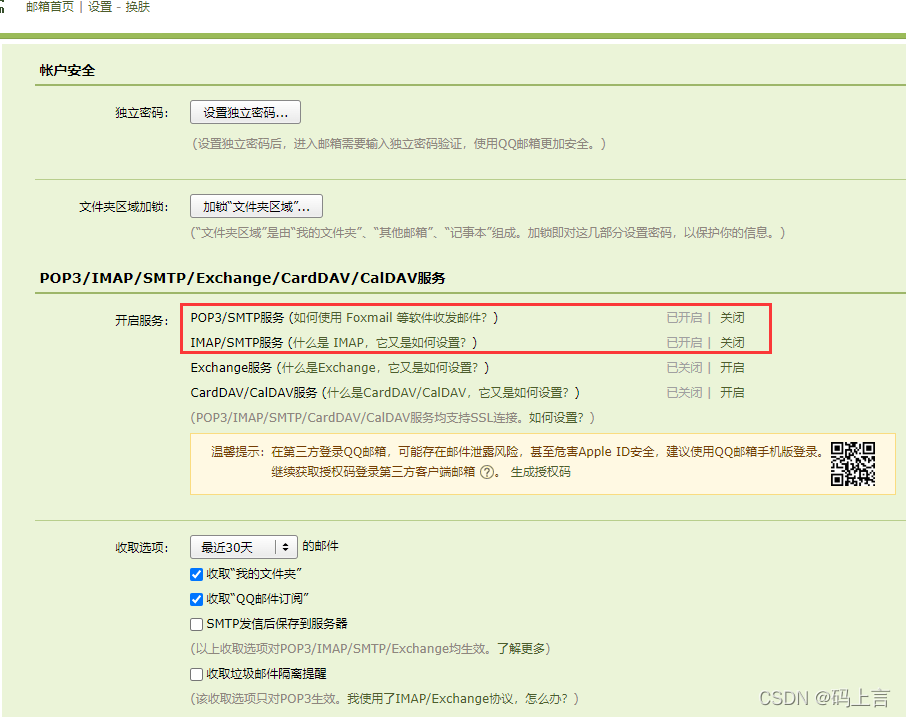


##### **7.2.3.2 编写邮箱发送实现**

***

`MailInfo.java`类主要是用来存放接收的邮箱、标题和邮件内容。具体如下代码：

```java
package com.blog.personalblog.config.mail;

import lombok.Builder;
import lombok.Data;

import java.util.List;

/**
 * 邮件接收配置信息
 *
 * @author: SuperMan
 * @create: 2022-01-24
 **/
@Builder
@Data
public class MailInfo {
    /**
     * 接收的邮箱
     */
    private String receiveMail;

    /**
     * 邮件标题
     */
    private String title;

    /**
     * 邮件内容
     */
    private String content;

}
```

接下里我们去写邮件发送配置`SendMailConfig.java`

```java
package com.blog.personalblog.config.mail;

import cn.hutool.extra.mail.MailAccount;
import cn.hutool.extra.mail.MailUtil;
import cn.hutool.json.JSONUtil;
import lombok.extern.log4j.Log4j2;

/**
 * 邮件发送
 * @author: SuperMan
 * @create: 2022-01-24
 **/
@Log4j2
public class SendMailConfig {

    /**
     * 邮件发送实现方法
     * @param mailInfo
     */
    public static void sendMail(MailInfo mailInfo) {
        try {
            MailAccount account = new MailAccount();
            //邮件服务器的SMTP地址
            account.setHost("smtp.qq.com");
            //邮件服务器的SMTP端口
            account.setPort(587);
            //发件人邮箱，改成你自己的
            account.setFrom("2529018799@qq.com");
            //密码，刚开通的授权码
            account.setPass("hnxnbltzeoyadicb");
            //使用SSL安全连接
            account.setSslEnable(false);
            MailUtil.send(account, mailInfo.getReceiveMail(),
                    mailInfo.getTitle(), mailInfo.getContent(), false);
            log.info("邮件发送成功！");
        } catch (Exception e) {
            log.error("邮件发送失败" + JSONUtil.toJsonStr(mailInfo));
        }

    }

}
```

`MailAccount`和`MailUtil`是`Hutool`的类，我们引入包直接使用即可。


这里我们把自己的qq邮箱写死了,就是无论是谁发送都会发送邮件给这个用户,则这样可以作为管理者


##### 7.3.3.3 添加通过id查找用户功能

***

然后我们需要添加文章的时候能够发送邮箱给管理者,这样作为管理者需要知道用户是谁,所以就需要查找用户,这里需要添加一个findByUserId的功能


`	UserService.java`

```java
 /**
 * 根据用户id查找用户
 * @param userId
 * @return
 */
User findByUserId(Integer userId);
```

`UserServiceImpl.java`

```java
@Override
public User findByUserId(Integer userId) {
    User user = userMapper.getUserById(userId);
    return user;
}
```

`UserMapper.java`

```java
/**
 * 根据用户id查找
 * @param userId
 * @return
 */
User getUserById(Integer userId);
```

`UserMapper.xml`

```xml
<select id="getUserById" parameterType="java.lang.Integer" resultMap="BaseResultMap">
     select * from person_user where id = #{userId, jdbcType=INTEGER}
</select>
```


##### 7.3.3.4 添加邮箱发送功能

这时我们已经有了邮箱发送功能和用户获取功能,可以直接在articleServiceImpl的saveArticle中添加

```java
 User user = userService.findByUserId(article.getUserId());
        //添加文章发送邮箱提醒
        String content = "【{0}】您好：\n" +
                "您已成功发布了标题为: {1} 的文章 \n" +
                "请注意查收！\n";
        MailInfo build = MailInfo.builder()
                .receiveMail(user.getEmail())
                .content(MessageFormat.format(content, user.getUserName(), article.getTitle()))
                .title("文章发布")
                .build();
        SendMailConfig.sendMail(build);
```

到目前为止，添加文章写完了


这时可以通过运行查看是否发送了qq邮箱

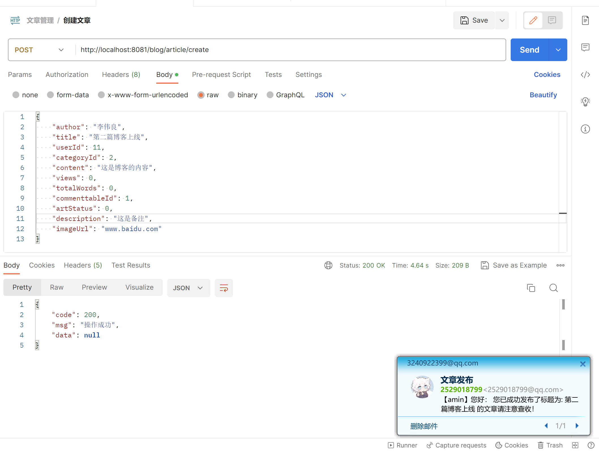

## 8.登录功能实现

### 8.1 获取前端项目模版

***

接下来开始进行前端项目的搭建工作,由于目前本人并没有学习前端，加上原作者也没有对前端进行具体的编写,那我们也直接使用vue的模板来简化开发

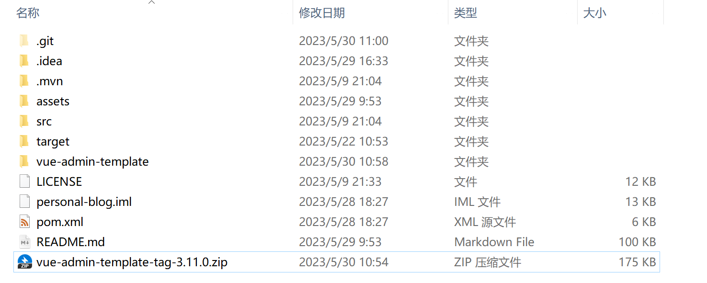

vue的模版已经放在github的主目录下,通过下载获取即可

### 8.2 Vue项目基础简介

***

我们通过vscode打开这个前端项目,以下为VUE项目的简介

```
├── build                      # 构建相关
├── mock                       # 项目mock 模拟数据
├── plop-templates             # 基本模板
├── public                     # 静态资源
│   │── favicon.ico            # favicon图标
│   └── index.html             # html模板
├── src                        # 源代码
│   ├── api                    # 所有请求
│   ├── assets                 # 主题 字体等静态资源
│   ├── components             # 全局公用组件
│   ├── directive              # 全局指令
│   ├── filters                # 全局 filter
│   ├── icons                  # 项目所有 svg icons
│   ├── lang                   # 国际化 language
│   ├── layout                 # 全局 layout
│   ├── router                 # 路由
│   ├── store                  # 全局 store管理
│   ├── styles                 # 全局样式
│   ├── utils                  # 全局公用方法
│   ├── vendor                 # 公用vendor
│   ├── views                  # views 所有页面
│   ├── App.vue                # 入口页面
│   ├── main.js                # 入口文件 加载组件 初始化等
│   └── permission.js          # 权限管理
├── tests                      # 测试
├── .env.xxx                   # 环境变量配置
├── .eslintrc.js               # eslint 配置项
├── .babelrc                   # babel-loader 配置
├── .travis.yml                # 自动化CI配置
├── vue.config.js              # vue-cli 配置
├── postcss.config.js          # postcss 配置
└── package.json               # package.json
```

`Ctrl+j`打开控制终端，键入   `npm install --registry=https://registry.npm.taobao.org`

安装依赖，依赖安装完成后，我们开始启动项目`npm run dev`

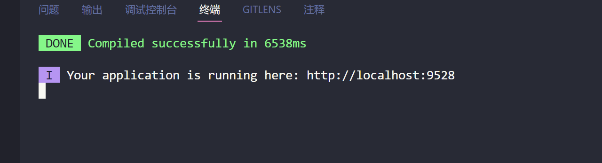

此时可以通过浏览器`http://localhost:9528/#/login?redirect=%2Fdashboard`访问页面

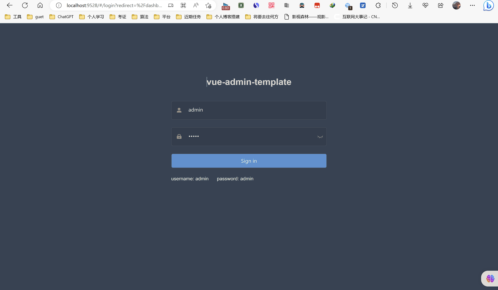

此时可以通过登录访问项目

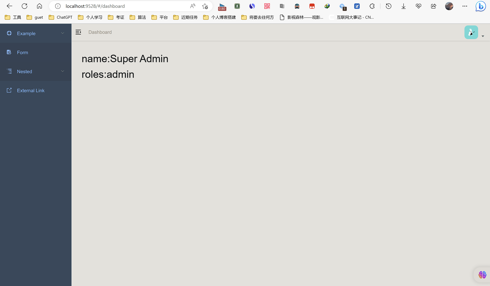


### 8.3 前端项目改造

***

#### 8.3.1 Mock修改与测试

***

​		前后端分离的开发模式，前端需要向后端请求数据（ajax请求），但实际开发过程中，前后端会约定一份接口文档，但前后端开发进度并不一致，当后端没有完善接口功能时，前端需要在本地模拟数据返回，此时需要使用到mockjs。

​		我们这个项目肯定是要连接我们的后台接口，所以这个mock我们就用不到了，所以我们将mock删掉或者禁掉即可。

删除mock文件夹后再将`src/main.js`文件中的使用mock的注释掉

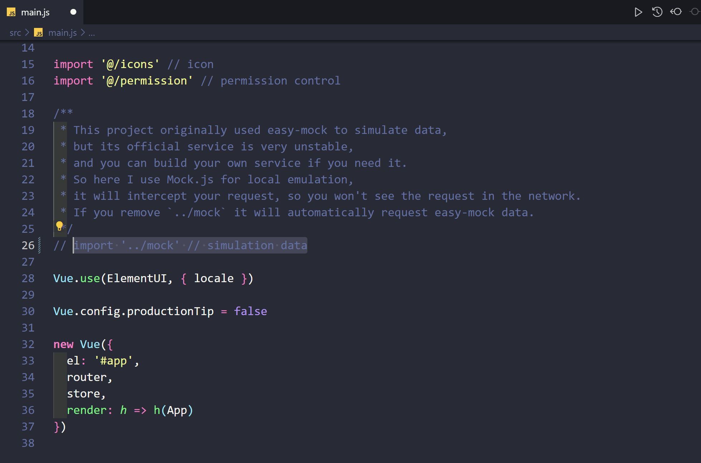

此时通过刷新网页再次登录会发现爆出Network Error的错误

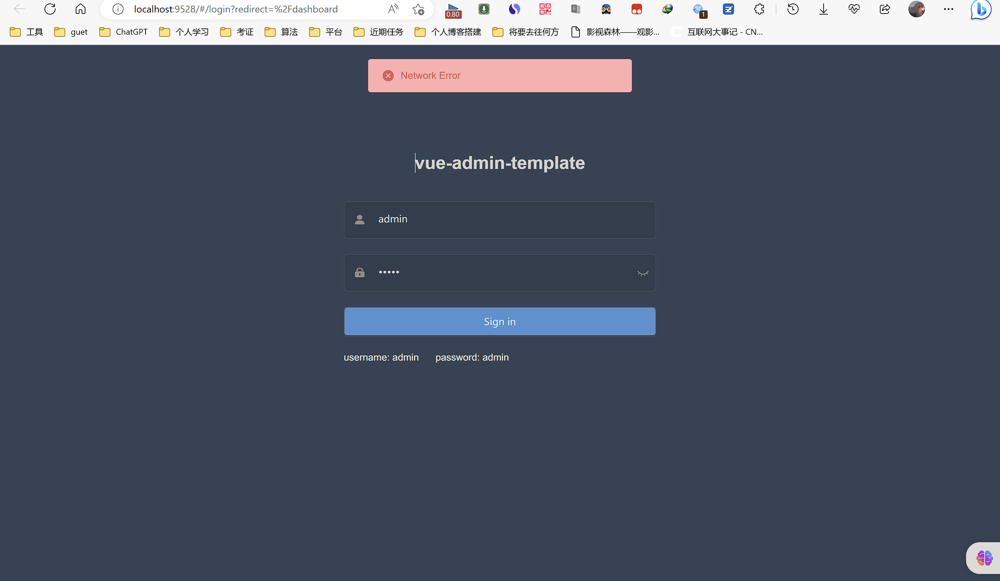


#### 8.3.2 请求地址修改与配置

打开开发者工具,发现通过点击发送请求到后端,并且具有URL地址

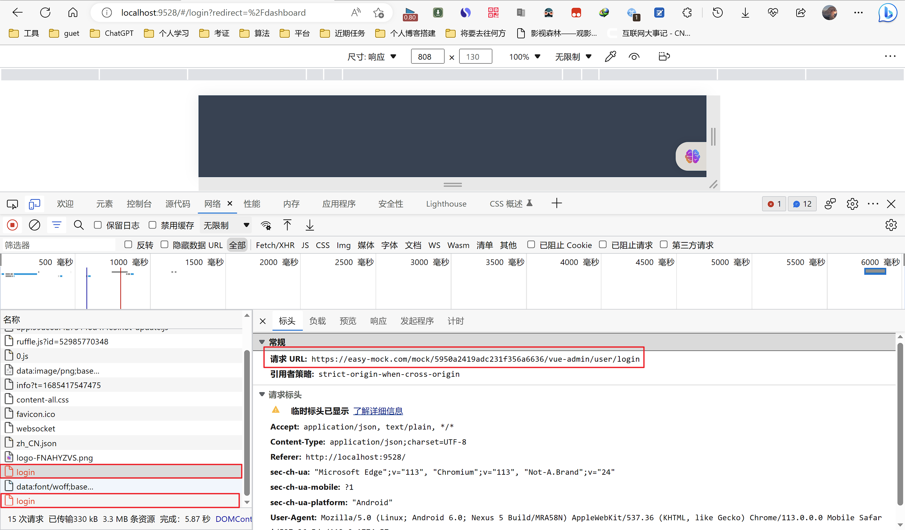


同时携带前端数据,传递给URL

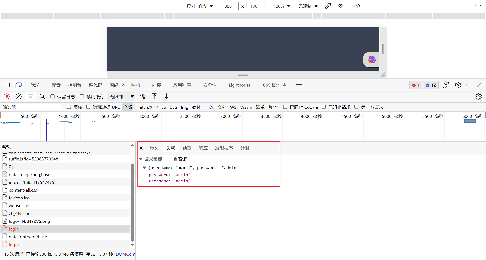


打开项目`config/dev.env.js`文件，可以看到项目调用的url前缀，在下面要把此处改为自己的服务接口地址,这里的地址需要与后端的url对应

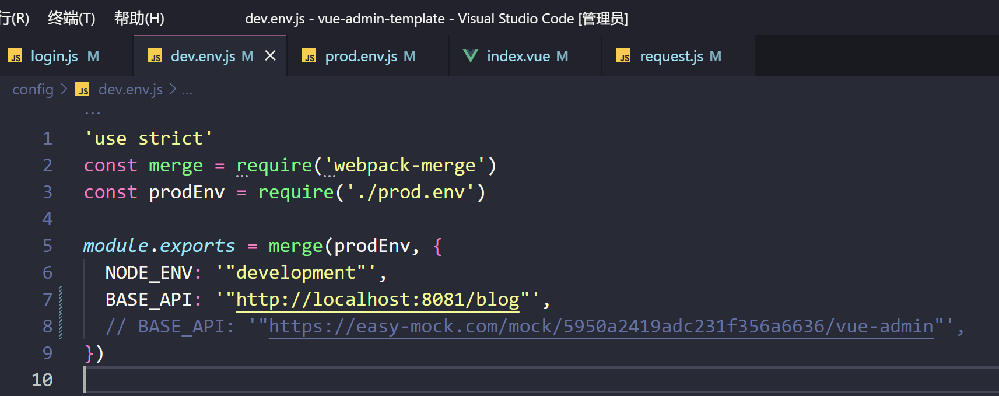

其中`dev.env.js`和`prod.env.js`都改一下

再次访问浏览器,发送请求发现url地址已经更改为后端地址

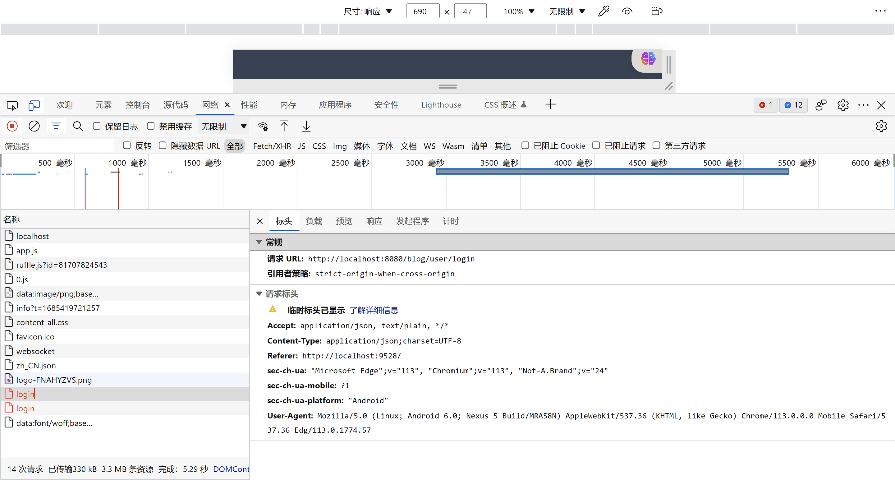


#### 8.3.3 代码简介

***

##### 8.3.3.1 前端接口

***

打开`src/api/login.js`，然后我们看到一个login方法，专门是登录的请求地址的，参数传递、请求的路径，这里说一下，如下图所示：

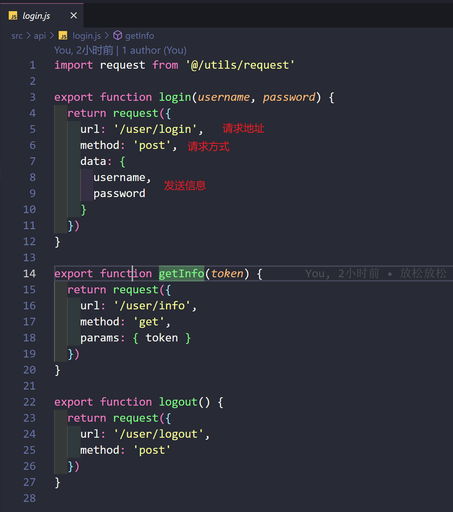

配置中的url地址 再加上在config文件配置的地址,组合起来就是完整的请求地址

这三个方法分别对应后端的三个接口，前两个是在登录页面上看到的,第三个是登出的接口


打开`src/views/login/index.vue`，可以看到有一个`handleLogin`方法，专门用来处理登录校验的信息：

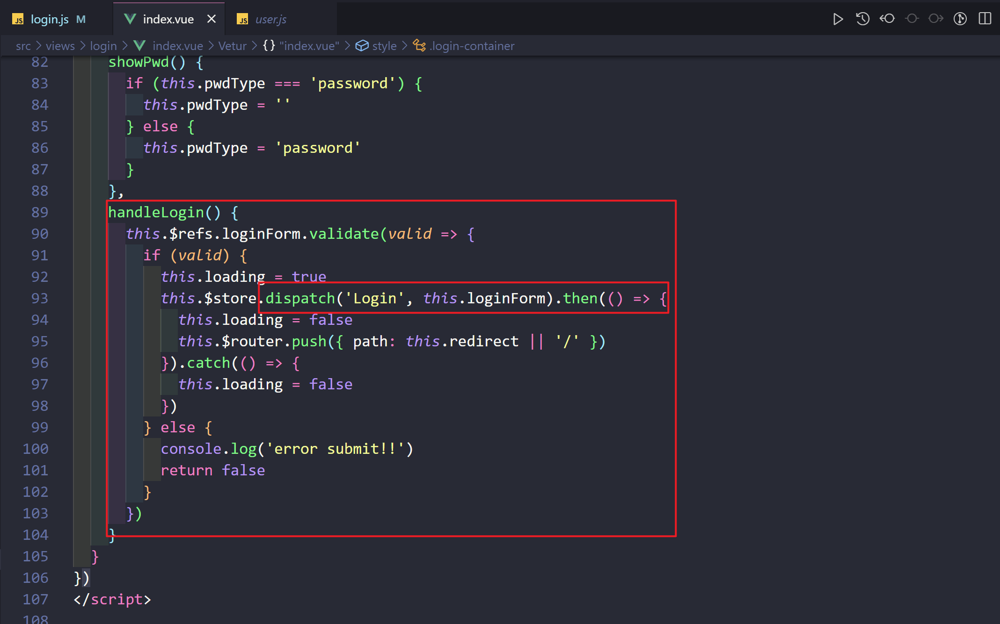

dispatch到了Login,通过Login来调用方法,接下来查找Login方法在哪里


同时通过查找发现在`/src/store/modules/user.js`中使用了这三个方法

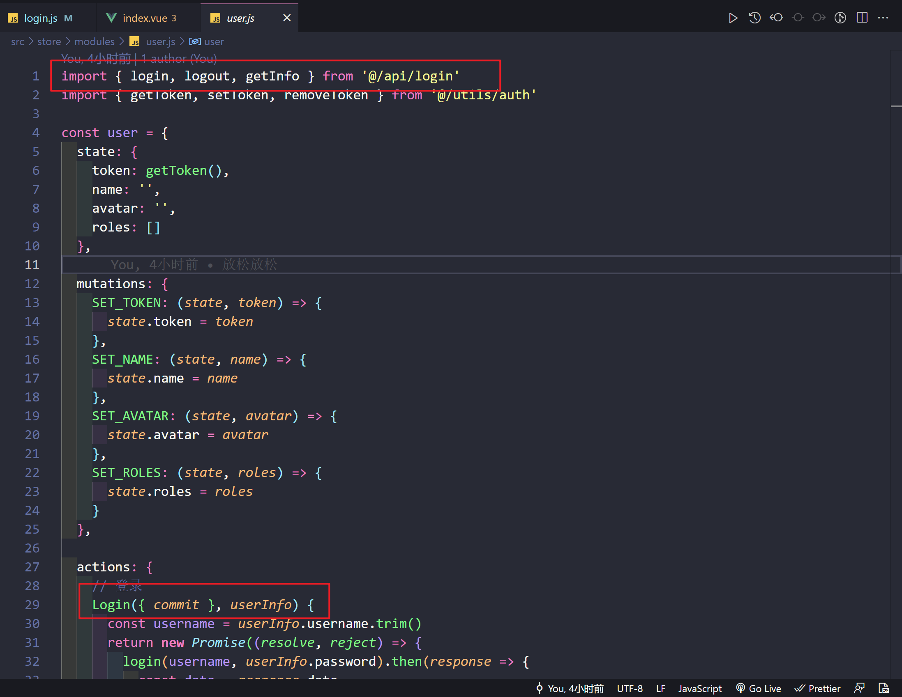


##### 8.3.3.2 登录接口请求详解

***

这里针对登录代码进行详细学习

###### 1.Promise简介

***

```js
  // 登录
    Login({ commit }, userInfo) {
      const username = userInfo.username.trim()
      return new Promise((resolve, reject) => {
        login(username, userInfo.password).then(response => {
          const data = response.data
          setToken(data.token)
          commit('SET_TOKEN', data.token)
          resolve()
        }).catch(error => {
          reject(error)
        })
      })
    },
```

`Promise`，译为承诺，是异步编程的一种解决方案，比传统的解决方案（回调函数）更加合理和更加强大，Promise对象是一个构造函数，用来生成Promise实例

```js
const promise = newPromise(function(resolve, reject) {});
```

● resolve函数的作用是，将Promise对象的状态从“未完成”变为“成功”
● reject函数的作用是，将Promise对象的状态从“未完成”变为“失败”


###### 2.dispatch方法

***

此时我们上边说过的dispatch这个方法的目的：

1. 发送login请求获取到token值
2. 并存储到Vuex状态管理模式中，供多个组件同时识别使用


#### 8.3.4 数据响应

***

vue-elemeent-template配置了自己的请求拦截,即自定义的拦截规则,我们通过查询发现在`/src/utils/request.js`中

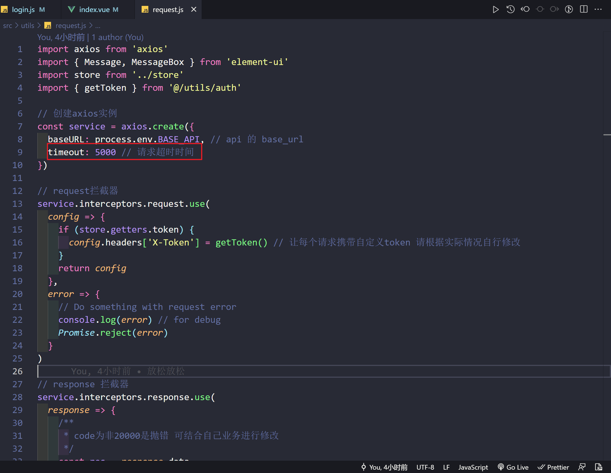

我们发现前端设置的请求超时时间设置为5秒,这里我们需要改动一下,设置为30秒

继续往下看,我们发现他针对请求和响应都设置了自定义的拦截器,这里我们发现有一个

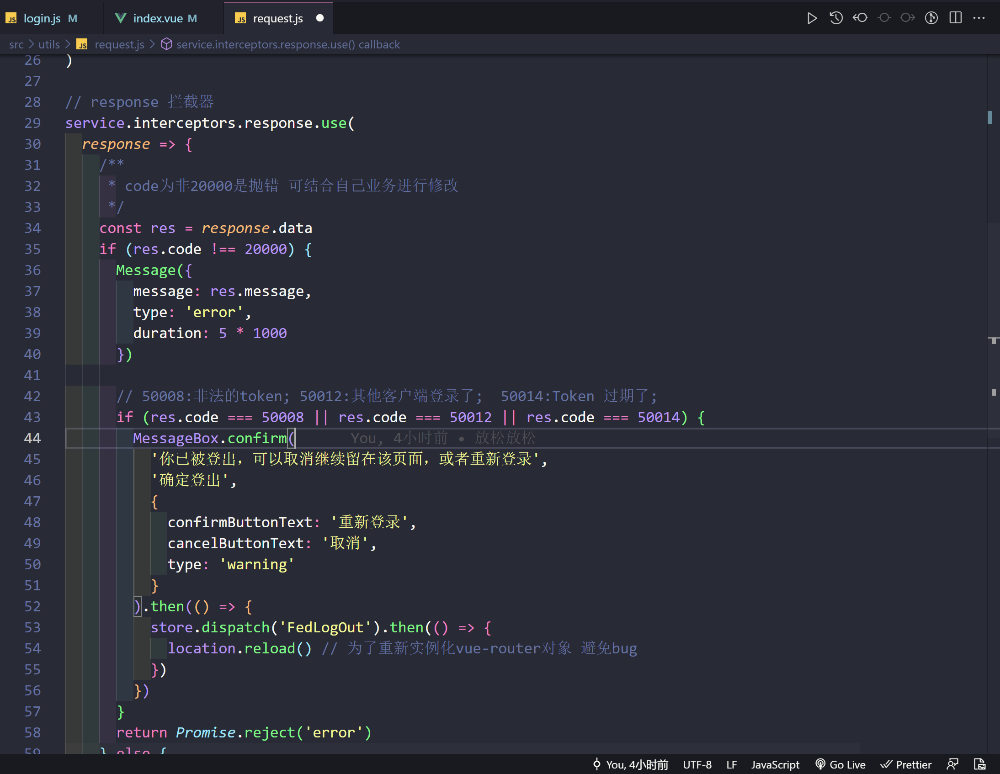

状态码不等于20000就报错,结合我们后端设置的报错响应码自定义为200

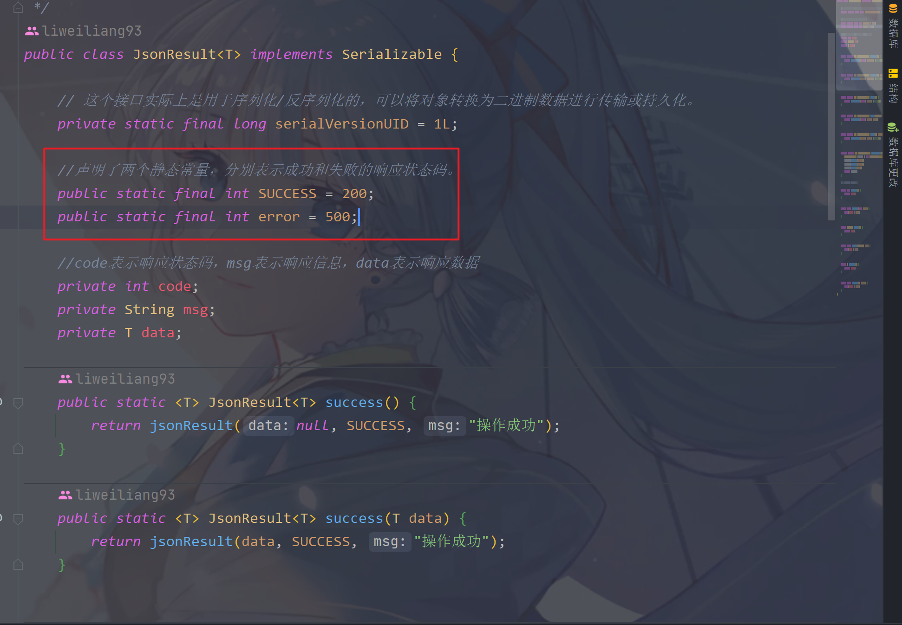这里我们把前端的成功的响应状态码也设置为200.

到这里前端的初始化工作基本完成,接下来进行后端的处理。


### 8.4 后端登录功能

***


#### 8.4.1 前端接口分析

这里我们开始写后端的登录功能,首先我们分析前端需要调用后端的哪个接口进行登录呢,回想一下刚才那三个接口,分别对应url前缀为`http://localhost:8081/blog`加上`user/*`的接口

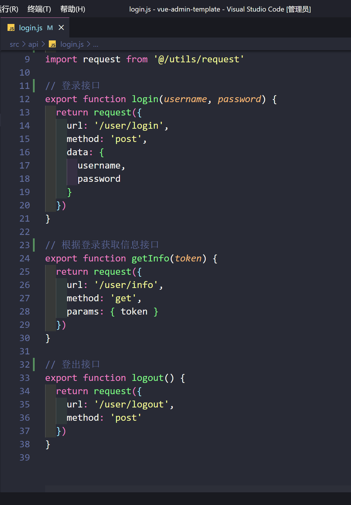

正好与我们的后端项目前缀相对应,这里我们只需要创建对应的controller与之对应即可。


#### 8.4.2 controller添加登录方法

***

**1.创建登录实体类**

```java
/**
 * @author liweiliang
 * @create 2023-05-30 15:40:56
 * @description 登录实体类
 */
@Data
public class LoginModel {
    private String username;
    private String password;
}
```


**2.controller添加登录方法**

这里使用slf4j提供的logger类进行控制台日志输出

```java
import org.slf4j.Logger;
import org.slf4j.LoggerFactory;

//类内部定义
private Logger logger = LoggerFactory.getLogger(this.getClass());
```


```java
    /**
     * @details: 用户登录
     * @date: 2023/5/30
     * @Param: [loginModel]
     * @return: com.blog.personalblog.util.JsonResult<java.lang.Object>
     */
    @PostMapping("/login")
    public JsonResult<Object> login(@RequestBody LoginModel loginModel){
        logger.info("{} login success", loginModel.getUsername());

        return JsonResult.success();
    }

    /**
     * @details: 登录info信息
     * @date: 2023/5/30
     * @Param: []
     * @return: com.blog.personalblog.util.JsonResult<java.lang.Object>
     */
    @GetMapping("/info")
    public JsonResult<Object> info(){
        return JsonResult.success();
    }
```


#### 8.4.3 Apache Shiro简介

***

`Apache Shiro` 是 Java 的一个安全框架。对比 `Spring Security`它相当简单，没有 `pring Security` 做的功能强大

关于 Shiro，需要理解三个核心概念：`Subject`、`SecurityManager` 和 `Realms`。

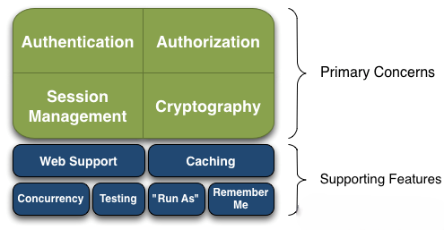


**Shiro 不会去维护用户、维护权限；这些需要我们自己去设计 / 提供；然后通过相应的接口注入给 Shiro 即可**

● Authentication：身份认证 / 登录，验证用户是不是拥有相应的身份；
● Authorization：授权，即权限验证，验证某个已认证的用户是否拥有某个权限；即判断用户是否能做事情，常见的如：验证某个用户是否拥有某个角色。或者细粒度的验证某个用户对某个资源是否具有某个权限；
● Session Management：会话管理，即用户登录后就是一次会话，在没有退出之前，它的所有信息都在会话中；会话可以是普通 JavaSE 环境的，也可以是如 Web 环境的；
● Cryptography：加密，保护数据的安全性，如密码加密存储到数据库，而不是明文存储；
● Web Support：Web 支持，可以非常容易的集成到 Web 环境；
● Caching：缓存，比如用户登录后，其用户信息、拥有的角色 / 权限不必每次去查，这样可以提高效率；
● Concurrency：shiro 支持多线程应用的并发验证，即如在一个线程中开启另一个线程，能把权限自动传播过去；
● Testing：提供测试支持；
● Run As：允许一个用户假装为另一个用户（如果他们允许）的身份进行访问；
● Remember Me：记住我，这个是非常常见的功能，即一次登录后，下次再来的话不用登录


**架构**

`Subject`：主体，代表了当前 “用户”，这个用户不一定是一个具体的人，与当前应用交互的任何东西都是 Subject，如网络爬虫，机器人等；即一个抽象概念；所有 Subject 都绑定到 SecurityManager，与 Subject 的所有交互都会委托给 SecurityManager；可以把 Subject 认为是一个门面；SecurityManager 才是实际的执行者；
`SecurityManager`：安全管理器；即所有与安全有关的操作都会与 SecurityManager 交互；且它管理着所有 Subject；可以看出它是 Shiro 的核心，它负责与后边介绍的其他组件进行交互，如果学习过 SpringMVC，你可以把它看成 DispatcherServlet 前端控制器；
`Realm`：域，Shiro 从 Realm 获取安全数据（如用户、角色、权限），就是说 SecurityManager 要验证用户身份，那么它需要从 Realm 获取相应的用户进行比较以确定用户身份是否合法；也需要从 Realm 得到用户相应的角色 / 权限进行验证用户是否能进行操作；可以把Realm看成 DataSource，即安全数据源。

​		也就是说最简单的一个 Shiro 应用：应用代码通过 Subject 来进行认证和授权，而 Subject 又委托给 SecurityManager；我们需要给 Shiro 的 SecurityManager 注入 Realm，从而让 SecurityManager能得到合法的用户及其权限进行判断。
​		从以上也可以看出，**Shiro 不提供维护用户 / 权限，而是通过 Realm 让开发人员自己注入**。

​		可以参考这个进行学习：https://www.w3cschool.cn/shiro/andc1if0.html


#### 8.4.4 后端登录详细编写

***

##### **1.在maven中添加shiro依赖**

***

```xml
<dependency>
     <groupId>org.apache.shiro</groupId>
     <artifactId>shiro-spring</artifactId>
     <version>1.4.0</version>
</dependency>
```


##### **2.添加一个根据用户名查找用户对象的接口**

***

`UserServiceImpl.java`

```java
@Override
public User getUserByUserName(String userName) {
    if (userName == null) {
        return null;
    }
    User user = userMapper.getUserByUserName(userName);
    return user;
}
```

`UserService.java`

```java
    /**
     * @details: 根据用户名查询用户对象
     * @date: 2023/5/30
     * @Param: [userName]
     * @return: com.blog.personalblog.entity.User
     */
    User getUserByUserName(String userName);
```

`UserMapper.java`

```java
    /**
     * @details: 根据用户名查找用户
     * @date: 2023/5/30
     * @Param: [userName]
     * @return: com.blog.personalblog.entity.User
     */
    User getUserByUserName(String userName);
```

`UserMapper.xml`

```xml
<select id="getUserByUserName" resultType="com.blog.personalblog.entity.User">
    select * from person_user where username = #{userName, jdbcType=VARCHAR}
</select>
```

准备工作写完后，接下来就可以去配置shiro环境


##### 3.配置Shiro环境

***

配置的顺序如下：

1. 创建 Realm 并重写获取认证与授权信息的方法。
2. 创建配置类，包括创建并配置 SecurityManager 等。

①新建一个`shiro包`，在这个包里新建一个`MyShiroRealm.java`，继承一下`AuthorizingRealm`

```java
/**
 * @author liweiliang
 * @create 2023-05-30 16:50:39
 * @description
 */
public class MyShiroRealm extends AuthorizingRealm {
    @Override
    protected AuthorizationInfo doGetAuthorizationInfo(PrincipalCollection principalCollection) {
        return null;
    }

    @Override
    protected AuthenticationInfo doGetAuthenticationInfo(AuthenticationToken authenticationToken) throws AuthenticationException {
        return null;
    }
}
```


1.`doGetAuthenticationInfo` 获取身份验证相关信息：首先根据传入的用户名获取 User 信息；然后如果 user 为空，那么抛出没找到帐号异常 UnknownAccountException；如果 user 找到但锁定了抛出锁定异常 LockedAccountException；最后生成 AuthenticationInfo 信息，交给间接父类 AuthenticatingRealm 使用 CredentialsMatcher 进行判断密码是否匹配，如果不匹配将抛出密码错误异常 IncorrectCredentialsException；另外如果密码重试此处太多将抛出超出重试次数异常 ExcessiveAttemptsException；在组装 SimpleAuthenticationInfo 信息时，需要传：身份信息（用户名）、凭据（密文密码）、盐（username+salt），CredentialsMatcher 使用盐加密传入的明文密码和此处的密文密码进行匹配。
2.`doGetAuthorizationInfo` 获取授权信息：PrincipalCollection 是一个身份集合，因为我们现在就一个 Realm，所以直接调用 getPrimaryPrincipal 得到之前传入的用户名即可；然后根据用户名调用 UserService 接口获取角色及权限信息。


②这里不存在权限验证,重写这两个方法--完整代码

```java
/**
 * @author liweiliang
 * @create 2023-05-30 16:50:39
 * @description
 */
public class MyShiroRealm extends AuthorizingRealm {

    @Autowired
    UserService userService;

    @Override
    protected AuthorizationInfo doGetAuthorizationInfo(PrincipalCollection principalCollection) {
        SimpleAuthorizationInfo authorizationInfo = new SimpleAuthorizationInfo();
        User user  = (User) principalCollection.getPrimaryPrincipal();
        //模拟数据库查询出来的用户角色对应的权限
        String rolePermission = "/admin";
        authorizationInfo.addStringPermission(rolePermission);
        return authorizationInfo;
    }


    @Override
    protected AuthenticationInfo doGetAuthenticationInfo(AuthenticationToken authenticationToken) throws AuthenticationException {
        System.out.println("进行身份认证中...");
        //获取输入的账号
        String userName = (String) authenticationToken.getPrincipal();
        //获取输入的密码
        //shiro会把密码转为字符，所以这里需要把字符转字符串
        String password = new String((char[]) authenticationToken.getCredentials());

        //通过userName从数据库中查找 User对象
        User user = userService.getUserByUserName(userName);

        String s = MD5Util.MD5(password);
        if (user == null || !user.getPassWord().equals(s)) {
            throw new AccountException("用户名或密码不正确");
        }
        SimpleAuthenticationInfo authenticationInfo = new SimpleAuthenticationInfo(
                user.getUserName(),
                user.getPassWord(),
                null,
                getName()
        );
        return authenticationInfo;
    }
}
```


③新建一个shiro的配置类，这个配置类要和我们的启动类在同一个层中`ShiroConfiguration.java`

```java
package com.blog.personalblog;


import com.blog.personalblog.shiro.MyShiroRealm;
import org.apache.shiro.authc.credential.HashedCredentialsMatcher;
import org.apache.shiro.mgt.SecurityManager;
import org.apache.shiro.spring.security.interceptor.AuthorizationAttributeSourceAdvisor;
import org.apache.shiro.spring.web.ShiroFilterFactoryBean;
import org.apache.shiro.web.mgt.DefaultWebSecurityManager;
import org.springframework.context.annotation.Bean;
import org.springframework.context.annotation.Configuration;

import java.util.LinkedHashMap;
import java.util.Map;

/**
 * @author: SuperMan
 * @create: 2022-03-14
 **/
@Configuration
public class ShiroConfiguration {

    /**
     * 配置过滤规则
     *
     */
    @Bean
    public ShiroFilterFactoryBean shirFilter(SecurityManager securityManager) {
        System.out.println("ShiroConfiguration.shirFilter()");
        ShiroFilterFactoryBean shiroFilterFactoryBean = new ShiroFilterFactoryBean();
        shiroFilterFactoryBean.setSecurityManager(securityManager);

        //拦截器
        Map<String, String> filterChainDefinitionMap = new LinkedHashMap<>();
        filterChainDefinitionMap.put("/user/logout", "logout");
        // 配置不会被拦截的链接 顺序判断
        filterChainDefinitionMap.put("/static/**", "anon");
        filterChainDefinitionMap.put("/user/login", "anon");
        filterChainDefinitionMap.put("/user/info", "anon");
        filterChainDefinitionMap.put("/**", "authc");
        //配置shiro默认登录界面地址，前后端分离中登录界面跳转应由前端路由控制，后台仅返回json数据
        filterChainDefinitionMap.put("/user/unauth", "anon");

        shiroFilterFactoryBean.setFilterChainDefinitionMap(filterChainDefinitionMap);
        return shiroFilterFactoryBean;
    }

    /**
     * 凭证匹配器
     * （由于我们的密码校验交给Shiro的SimpleAuthenticationInfo进行处理了
     * ）
     *
     * @return
     */
    @Bean
    public HashedCredentialsMatcher hashedCredentialsMatcher() {
        HashedCredentialsMatcher hashedCredentialsMatcher = new HashedCredentialsMatcher();
        //散列算法:这里使用MD5算法;
        hashedCredentialsMatcher.setHashAlgorithmName("md5");
        //散列的次数，比如散列两次，相当于 md5(md5(""));
        hashedCredentialsMatcher.setHashIterations(1);
        return hashedCredentialsMatcher;
    }

    /**
     * 创建 Realm
     * @Bean 的作用： 将该方法返回的对象放入spring容器
     */
    @Bean
    public MyShiroRealm myShiroRealm() {
        MyShiroRealm myShiroRealm = new MyShiroRealm();
        myShiroRealm.setCredentialsMatcher(hashedCredentialsMatcher());
        return myShiroRealm;
    }

    @Bean
    public SecurityManager securityManager() {
        DefaultWebSecurityManager securityManager =  new DefaultWebSecurityManager();
        securityManager.setRealm(myShiroRealm());
        return securityManager;
    }

    /**
     * 开启aop注解支持
     * @param securityManager
     * @return
     */
    @Bean
    public AuthorizationAttributeSourceAdvisor authorizationAttributeSourceAdvisor(SecurityManager securityManager) {
        AuthorizationAttributeSourceAdvisor authorizationAttributeSourceAdvisor = new AuthorizationAttributeSourceAdvisor();
        authorizationAttributeSourceAdvisor.setSecurityManager(securityManager);
        return authorizationAttributeSourceAdvisor;
    }
}
```


##### 4.编写登录接口的功能

***

①先创建一个错误码类，用来统一规范我们返回的错误信息。使用枚举类

```java
@PostMapping("/login")
    public JsonResult<Object> login(@RequestBody LoginModel loginModel){
        //打印登录请求信息
        logger.info("{} 在请求登录！ ", loginModel.getUsername());
        //获得当前用户到登录对象，现在状态为未认证。
        Subject subject = SecurityUtils.getSubject();
        //获得用户名密码令牌
        UsernamePasswordToken token = new UsernamePasswordToken(loginModel.getUsername(), loginModel.getPassword(), false);
        //使用异常捕捉登录失败消息
        try {
            //然后将令牌传到shiro提供的login方法验证，需要自定义realm
            subject.login(token);
            Map<String, Object> ret = new HashedMap();
            //login接口后边还带了token，我们在登录验证后，再将token返回给前端
            ret.put("token", subject.getSession().getId());
            logger.info("{} login success", loginModel.getUsername());
            return JsonResult.success(ret);
        } catch (IncorrectCredentialsException e) {
            logger.info("login fail {}", e.getMessage());
            return JsonResult.error(ErrorCode.NOT_LOGIN);
        } catch (LockedAccountException e) {
            logger.info("login fail {}", e.getMessage());
            return JsonResult.error(ErrorCode.ERROR_CODE);
        } catch (AuthenticationException e) {
            logger.info("login fail {}", e.getMessage());
            return JsonResult.error(ErrorCode.USER_NOT_EXIST);
        } catch (Exception e) {
            e.printStackTrace();
            logger.info("login fail {}", e.getMessage());
            return JsonResult.error(ErrorCode.ERROR_CODE);
        }
    }
```

②编写登录接口login

```java
    @GetMapping("/info")
    public JsonResult<Object> info(){
        Map<String, Object> ret = new HashMap<>(3);
        ret.put("roles", "[admin]");
        ret.put("name", "admin");
        ret.put("avatar","https://wpimg.wallstcn.com/f778738c-e4f8-4870-b634-56703b4acafe.gif");
        return JsonResult.success(ret);
    }
```

③退出和登录地址错误的直接重定向到这个接口

```java
   @PostMapping("/logout")
    public JsonResult<Object> logout(){
        Subject subject =SecurityUtils.getSubject();
        subject.logout();
        return JsonResult.success("成功登出");
    }

    @RequestMapping("/unauth")
    public JsonResult<Object> unauth(){
        return JsonResult.error(ErrorCode.NOT_LOGIN);
    }

```


④跨域请求问题解决

此时基本的登录功能已经完成了,但是当一个请求url的**协议、域名、端口**三者之间任意一个与当前页面url不同时就需要跨域。

后端添加一个注解即可`@CrossOrigin`,在Controller类或其方法上加`@CrossOrigin`注解，来使之支持跨域或者写一个全局的，适用整个项目的接口。

这里我们使用后者,新建`ResourcesConfig.java`与启动类同目录下

```java
package com.blog.personalblog;


import com.blog.personalblog.shiro.MyShiroRealm;
import org.apache.shiro.authc.credential.HashedCredentialsMatcher;
import org.apache.shiro.mgt.SecurityManager;
import org.apache.shiro.spring.security.interceptor.AuthorizationAttributeSourceAdvisor;
import org.apache.shiro.spring.web.ShiroFilterFactoryBean;
import org.apache.shiro.web.mgt.DefaultWebSecurityManager;
import org.springframework.context.annotation.Bean;
import org.springframework.context.annotation.Configuration;

import java.util.LinkedHashMap;
import java.util.Map;

/**
 * @author liweiliang
 * @create 2023-05-30 17:01:09
 * @description
 */
@Configuration
public class ShiroConfiguration {

    /**
     * 配置过滤规则
     */
    @Bean
    public ShiroFilterFactoryBean shirFilter(SecurityManager securityManager) {
        System.out.println("ShiroConfiguration.shirFilter()");
        ShiroFilterFactoryBean shiroFilterFactoryBean = new ShiroFilterFactoryBean();
        shiroFilterFactoryBean.setSecurityManager(securityManager);

        //拦截器
        Map<String, String> filterChainDefinitionMap = new LinkedHashMap<>();
        filterChainDefinitionMap.put("/user/logout", "logout");
        // 配置不会被拦截的链接 顺序判断
        filterChainDefinitionMap.put("/static/**", "anon");
        filterChainDefinitionMap.put("/user/login", "anon");
        filterChainDefinitionMap.put("/user/info", "anon");
        filterChainDefinitionMap.put("/**", "authc");
        //配置shiro默认登录界面地址，前后端分离中登录界面跳转应由前端路由控制，后台仅返回json数据
        filterChainDefinitionMap.put("/user/unauth", "anon");

        shiroFilterFactoryBean.setFilterChainDefinitionMap(filterChainDefinitionMap);
        return shiroFilterFactoryBean;
    }

    /**
     * 凭证匹配器
     * （由于我们的密码校验交给Shiro的SimpleAuthenticationInfo进行处理了
     * ）
     *
     * @return
     */
    @Bean
    public HashedCredentialsMatcher hashedCredentialsMatcher() {
        HashedCredentialsMatcher hashedCredentialsMatcher = new HashedCredentialsMatcher();
        //散列算法:这里使用MD5算法;
        hashedCredentialsMatcher.setHashAlgorithmName("md5");
        //散列的次数，比如散列两次，相当于 md5(md5(""));
        hashedCredentialsMatcher.setHashIterations(1);
        return hashedCredentialsMatcher;
    }

    /**
     * 创建 Realm
     *
     * @Bean 的作用： 将该方法返回的对象放入spring容器
     */
    @Bean
    public MyShiroRealm myShiroRealm() {
        MyShiroRealm myShiroRealm = new MyShiroRealm();
        myShiroRealm.setCredentialsMatcher(hashedCredentialsMatcher());
        return myShiroRealm;
    }

    @Bean
    public SecurityManager securityManager() {
        DefaultWebSecurityManager securityManager = new DefaultWebSecurityManager();
        securityManager.setRealm(myShiroRealm());
        return securityManager;
    }

    /**
     * 开启aop注解支持
     *
     * @param securityManager
     * @return
     */
    @Bean
    public AuthorizationAttributeSourceAdvisor authorizationAttributeSourceAdvisor(SecurityManager securityManager) {
        AuthorizationAttributeSourceAdvisor authorizationAttributeSourceAdvisor = new AuthorizationAttributeSourceAdvisor();
        authorizationAttributeSourceAdvisor.setSecurityManager(securityManager);
        return authorizationAttributeSourceAdvisor;
    }
}
```


⑥前后端分离会话问题解决

登录的时候拿到的`Cookie`没有进行后端的会话存储，导致我们页面请求出现`302`的问题,这里先解决前后端分离项目中使用`shiro的会话`问题,选择的是redis来存储会话信息

(1)导入redis的jar包

```xml
<dependency>
     <groupId>org.crazycake</groupId>
     <artifactId>shiro-redis</artifactId>
     <version>2.4.2.1-RELEASE</version>
</dependency>
```

(2)自定义SessionManager类

shiro包中新建一个`MySessionManager.java`类,继承`DefaultWebSessionManager类`，会话管理即用户登录后就是一次会话，在没有退出之前，它的所有信息都在会话中；会话可以是普通 JavaSE 环境的，也可以是如 Web 环境的，负责管理shiro自己封装的session的生命周期。

```java
public class MySessionManager extends DefaultWebSessionManager {
    private static final String AUTHORIZATION = "Authorization";

    private static final String REFERENCED_SESSION_ID_SOURCE = "Stateless request";

    public MySessionManager() {
        super();
    }

    @Override
    protected Serializable getSessionId(ServletRequest request, ServletResponse response) {
        String id = WebUtils.toHttp(request).getHeader(AUTHORIZATION);
        //如果请求头中有 Authorization 则其值为sessionId
        if (!StringUtils.isEmpty(id)) {
            request.setAttribute(ShiroHttpServletRequest.REFERENCED_SESSION_ID_SOURCE, REFERENCED_SESSION_ID_SOURCE);
            request.setAttribute(ShiroHttpServletRequest.REFERENCED_SESSION_ID, id);
            request.setAttribute(ShiroHttpServletRequest.REFERENCED_SESSION_ID_IS_VALID, Boolean.TRUE);
            return id;
        } else {
            //否则按默认规则从cookie取sessionId
            return super.getSessionId(request, response);
        }
    }
}
```

**为什么shiro要自己封装session？**
1.可以为任意应用提供session支持，不依赖于底层容器
2.简单扩容session管理容器，可以实现任何数据源（redis，ehcache）来管理session，而不必担心jvm内存溢出。

(3)**配置文件配置redis**

```yml
  redis:
    host: 127.0.0.1
    port: 6379
    timeout: 300
    password:
  data:
    redis:
      repositories:
        enabled: false
```

(4)在ShiroConfig类中引入这些配置

```java
@Value("${spring.redis.host}")
private String host;
@Value("${spring.redis..port}")
private int port;
@Value("${spring.redis.timeout}")
private int timeout;
@Value("${spring.redis.password}")
private String password;
```

(5)**自定义sessionManger**

```java
/**
 * 自定义sessionManager，用户的唯一标识，即Token或Authorization的认证
 * @return
 */
@Bean
public SessionManager sessionManager() {
    //创建一个上面自定的SessionManager
    MySessionManager mySessionManager = new MySessionManager();
    mySessionManager.setSessionDAO(redisSessionDAO());
    return mySessionManager;
}
```

(6)**配置shiro redisManager**

```java
/**
 * 配置shiro redisManager,使用的是shiro-redis开源插件
 *
 * @return
 */
public RedisManager redisManager() {
    RedisManager redisManager = new RedisManager();
    redisManager.setHost(host);
    redisManager.setPort(port);
    // 配置缓存过期时间
    redisManager.setExpire(1800);
    redisManager.setTimeout(timeout);
    redisManager.setPassword(password);
    return redisManager;
}
```

(7)**cacheManager 缓存**

```java
/**
 * cacheManager 缓存 redis实现
 * @return
 */
@Bean
public RedisCacheManager cacheManager() {
    RedisCacheManager redisCacheManager = new RedisCacheManager();
    redisCacheManager.setRedisManager(redisManager());
    return redisCacheManager;
}
```

(8)**自定义session管理**

```java
/**
 * RedisSessionDAO shiro sessionDao层的实现 通过redis
 * @return
 */
@Bean
public RedisSessionDAO redisSessionDAO() {
    RedisSessionDAO redisSessionDAO = new RedisSessionDAO();
    // 自定义session管理 使用redis
    redisSessionDAO.setRedisManager(redisManager());
    return redisSessionDAO;
}
```

（9）SessionManager注入安全管理器

```java
@Bean
public SecurityManager securityManager() {
    DefaultWebSecurityManager securityManager =  new DefaultWebSecurityManager();
    //一定要通过上面的定义来加载自定义realm,否则在自定义realm中无法注入service层
    securityManager.setRealm(myShiroRealm());
    // 自定义session管理 使用redis
    securityManager.setSessionManager(sessionManager());
    // 自定义缓存实现 使用redis
    securityManager.setCacheManager(cacheManager());
    return securityManager;
}
```

（10)再修改一下我们之前的配置过滤规则`shirFilter`这个方法。这里只需要去掉info接口即可。

```java
filterChainDefinitionMap.put("/user/info", "anon");\
```

(11）更新一下info方法

```java
/**
 * @details: 登录info信息
 * @date: 2023/5/30
 * @Param: []
 * @return: com.blog.personalblog.util.JsonResult<java.lang.Object>
 */
@GetMapping("/info")
public JsonResult<Object> info(){
    String username = (String) SecurityUtils.getSubject().getPrincipal();
    User user = userService.getUserByUserName(username);
    Map<String, Object> ret = new HashMap<>(3);
    ret.put("roles", "[admin]");
    ret.put("name", user.getUserName());
    ret.put("avatar","https://wpimg.wallstcn.com/f778738c-e4f8-4870-b634-56703b4acafe.gif");
    return JsonResult.success(ret);
}
```

还有两个接口，一个是退出的，还有一个登录地址错误的直接重定向到这个接口，看一下就可以了。

```java
   @PostMapping("/logout")
    public JsonResult<Object> logout(){
        Subject subject =SecurityUtils.getSubject();
        subject.logout();
        return JsonResult.success("成功登出");
    }

    @RequestMapping("/unauth")
    public JsonResult<Object> unauth(){
        return JsonResult.error(ErrorCode.NOT_LOGIN);
    }
```


##### 6.修改登录界面

***

```vue
<template>
  <div class="login-container">
    <el-form ref="loginForm" :model="loginForm" :rules="loginRules" class="login-form" auto-complete="on" label-position="left">
      <h3 class="title">个 人 博 客 管 理 系 统</h3>
      <el-form-item prop="username">
        <span class="svg-container">
          <svg-icon icon-class="user" />
        </span>
        <el-input v-model="loginForm.username" name="username" type="text" auto-complete="on" placeholder="账号" />
      </el-form-item>
      <el-form-item prop="password">
        <span class="svg-container">
          <svg-icon icon-class="password" />
        </span>
        <el-input
          :type="pwdType"
          v-model="loginForm.password"
          name="password"
          auto-complete="on"
          placeholder="密码"
          @keyup.enter.native="handleLogin" />
        <span class="show-pwd" @click="showPwd">
          <svg-icon :icon-class="pwdType === 'password' ? 'eye' : 'eye-open'" />
        </span>
      </el-form-item>
      <el-form-item>
        <el-button :loading="loading" type="primary" style="width:100%;" @click.native.prevent="handleLogin">
          登录
        </el-button>
      </el-form-item>
    </el-form>
  </div>
</template>

<script>
import { isvalidUsername } from '@/utils/validate'

export default {
  name: 'Login',
  data() {
    const validateUsername = (rule, value, callback) => {
      if (!isvalidUsername(value)) {
        callback(new Error('请输入正确的用户名'))
      } else {
        callback()
      }
    }
    const validatePass = (rule, value, callback) => {
      if (value.length < 5) {
        callback(new Error('密码不能小于5位'))
      } else {
        callback()
      }
    }
    return {
      loginForm: {
        username: undefined,
        password: undefined
      },
      loginRules: {
        username: [{ required: true, trigger: 'blur', validator: validateUsername }],
        password: [{ required: true, trigger: 'blur', validator: validatePass }]
      },
      loading: false,
      pwdType: 'undefined',
      redirect: undefined
    }
  },
  watch: {
    $route: {
      handler: function(route) {
        this.redirect = route.query && route.query.redirect
      },
      immediate: true
    }
  },
  methods: {
    showPwd() {
      if (this.pwdType === 'password') {
        this.pwdType = ''
      } else {
        this.pwdType = 'password'
      }
    },
    handleLogin() {
      this.$refs.loginForm.validate(valid => {
        if (valid) {
          this.loading = true
          this.$store.dispatch('Login', this.loginForm).then(() => {
            this.loading = false
            this.$router.push({ path: this.redirect || '/' })
          }).catch(() => {
            this.loading = false
          })
        } else {
          console.log('error submit!!')
          return false
        }
      })
      this.$notify.error({
        title: '登录失败',
        message: '请输入正确的用户名或密码！'
      })
    }
  }
}
</script>

<style rel="stylesheet/scss" lang="scss">
$bg:#2d3a4b;
$light_gray:#eee;

/* reset element-ui css */
.login-container {
  .el-input {
    display: inline-block;
    height: 47px;
    width: 85%;
    input {
      background: transparent;
      border: 0px;
      -webkit-appearance: none;
      border-radius: 0px;
      padding: 12px 5px 12px 15px;
      color: $light_gray;
      height: 47px;
      &:-webkit-autofill {
        -webkit-box-shadow: 0 0 0px 1000px $bg inset !important;
        -webkit-text-fill-color: #fff !important;
      }
    }
  }
  .el-form-item {
    border: 1px solid rgba(255, 255, 255, 0.1);
    background: rgba(0, 0, 0, 0.1);
    border-radius: 5px;
    color: #454545;
  }
}

</style>

<style rel="stylesheet/scss" lang="scss" scoped>
$bg:#2d3a4b;
$dark_gray:#889aa4;
$light_gray:#eee;
.login-container {
  position: fixed;
  height: 100%;
  width: 100%;
  background-color: $bg;
  .login-form {
    position: absolute;
    left: 0;
    right: 0;
    width: 520px;
    max-width: 100%;
    padding: 35px 35px 15px 35px;
    margin: 120px auto;
  }
  .tips {
    font-size: 14px;
    color: #fff;
    margin-bottom: 10px;
    span {
      &:first-of-type {
        margin-right: 16px;
      }
    }
  }
  .svg-container {
    padding: 6px 5px 6px 15px;
    color: $dark_gray;
    vertical-align: middle;
    width: 30px;
    display: inline-block;
  }
  .title {
    font-size: 26px;
    font-weight: 400;
    color: $light_gray;
    margin: 0px auto 40px auto;
    text-align: center;
    font-weight: bold;
  }
  .show-pwd {
    position: absolute;
    right: 10px;
    top: 7px;
    font-size: 16px;
    color: $dark_gray;
    cursor: pointer;
    user-select: none;
  }
}
</style>
```


##### 7.前后端会话分离问题解决 --- redis

***

1.导入shiro整合redis的jar包

```xml
<dependency>
     <groupId>org.crazycake</groupId>
     <artifactId>shiro-redis</artifactId>
     <version>2.4.2.1-RELEASE</version>
</dependency>
```

2.shiro包中新建一个`MySessionManager.java`类，然后这个类继承`DefaultWebSessionManager类`

```java
package com.blog.personalblog.shiro;

import org.apache.shiro.web.servlet.ShiroHttpServletRequest;
import org.apache.shiro.web.session.mgt.DefaultWebSessionManager;
import org.apache.shiro.web.util.WebUtils;
import org.springframework.util.StringUtils;

import javax.servlet.ServletRequest;
import javax.servlet.ServletResponse;
import java.io.Serializable;

/**
 * @author: SuperMan
 * @create: 2022-04-14
 **/
public class MySessionManager extends DefaultWebSessionManager {
    private static final String AUTHORIZATION = "Authorization";

    private static final String REFERENCED_SESSION_ID_SOURCE = "Stateless request";

    public MySessionManager() {
        super();
    }

    @Override
    protected Serializable getSessionId(ServletRequest request, ServletResponse response) {
        String id = WebUtils.toHttp(request).getHeader(AUTHORIZATION);
        //如果请求头中有 Authorization 则其值为sessionId
        if (!StringUtils.isEmpty(id)) {
            request.setAttribute(ShiroHttpServletRequest.REFERENCED_SESSION_ID_SOURCE, REFERENCED_SESSION_ID_SOURCE);
            request.setAttribute(ShiroHttpServletRequest.REFERENCED_SESSION_ID, id);
            request.setAttribute(ShiroHttpServletRequest.REFERENCED_SESSION_ID_IS_VALID, Boolean.TRUE);
            return id;
        } else {
            //否则按默认规则从cookie取sessionId
            return super.getSessionId(request, response);
        }
    }
}
```

3.下载并安装使用redis

4.注入`SessionManager`

（1）写在spring下

```yml
  redis:
    host: 127.0.0.1
    port: 6379
    timeout: 300
    password:
  data:
    redis:
      repositories:
        enabled: false
```

（2）在ShiroConfig类中引入这些配置。这里用到了一个注解`@Value`

```java
@Value("${spring.redis.host}")
private String host;
@Value("${spring.redis..port}")
private int port;
@Value("${spring.redis.timeout}")
private int timeout;
@Value("${spring.redis.password}")
private String password;
```

（3）自定义sessionManger

```java
/**
 * 自定义sessionManager，用户的唯一标识，即Token或Authorization的认证
 * @return
 */
@Bean
public SessionManager sessionManager() {
    //创建一个上面自定的SessionManager
    MySessionManager mySessionManager = new MySessionManager();
    mySessionManager.setSessionDAO(redisSessionDAO());
    return mySessionManager;
}
```

（4）配置shiro redisManager

```java
/**
 * 配置shiro redisManager,使用的是shiro-redis开源插件
 *
 * @return
 */
public RedisManager redisManager() {
    RedisManager redisManager = new RedisManager();
    redisManager.setHost(host);
    redisManager.setPort(port);
    // 配置缓存过期时间
    redisManager.setExpire(1800);
    redisManager.setTimeout(timeout);
    redisManager.setPassword(password);
    return redisManager;
}
```

（5）cacheManager 缓存

```java
/**
 * cacheManager 缓存 redis实现
 * @return
 */
@Bean
public RedisCacheManager cacheManager() {
    RedisCacheManager redisCacheManager = new RedisCacheManager();
    redisCacheManager.setRedisManager(redisManager());
    return redisCacheManager;
}
```

（6）自定义session管理

```java
/**
 * RedisSessionDAO shiro sessionDao层的实现 通过redis
 * @return
 */
@Bean
public RedisSessionDAO redisSessionDAO() {
    RedisSessionDAO redisSessionDAO = new RedisSessionDAO();
    // 自定义session管理 使用redis
    redisSessionDAO.setRedisManager(redisManager());
    return redisSessionDAO;
}
```

5.SessionManager注入安全管理器

（1）修改一下securityManger

```java
@Bean
public SecurityManager securityManager() {
    DefaultWebSecurityManager securityManager =  new DefaultWebSecurityManager();
    //一定要通过上面的定义来加载自定义realm,否则在自定义realm中无法注入service层
    securityManager.setRealm(myShiroRealm());
    // 自定义session管理 使用redis
    securityManager.setSessionManager(sessionManager());
    // 自定义缓存实现 使用redis
    securityManager.setCacheManager(cacheManager());
    return securityManager;
}
```

修改一下我们之前的配置过滤规则`shirFilter`

```java
filterChainDefinitionMap.put("/user/info", "anon");
```

再去登录的接口，打开`UserController.java`，找到info接口，我们这里可以获取到登录的用户了

```java
/**
 * 登录info信息
 * @return
 */
@GetMapping("/info")
public JsonResult<Object> info(){
    String username = (String) SecurityUtils.getSubject().getPrincipal();
    User user = userService.getUserByUserName(username);
    Map<String, Object> ret = new HashMap<>(3);
    ret.put("roles", "[admin]");
    ret.put("name", user.getUserName());
    ret.put("avatar","https://wpimg.wallstcn.com/f778738c-e4f8-4870-b634-56703b4acafe.gif");
    return JsonResult.success(ret);
}
```

此时登录不同的账号,界面就会显示不同的账号名字,到这里，后端的问题已经解决


## 9.操作日志功能

### 9.1 操作日志基础开发

##### 9.1.1 MVC编写

###### 1. sql语句

```sql
DROP TABLE IF EXISTS `person_operation_log`;
CREATE TABLE `person_operation_log` (
  `id`                    INT             NOT NULL PRIMARY KEY AUTO_INCREMENT     COMMENT '主键',
  `operation_ip`          VARCHAR(128)        NULL DEFAULT 0                      COMMENT '主机地址',
  `opera_location`        VARCHAR(255)        NULL DEFAULT ''                     COMMENT '操作地点',
  `methods`               TEXT                NULL                                COMMENT '方法名',
  `args`          		  TEXT                NULL                                COMMENT '请求参数',
  `operation_name`        VARCHAR(50)     NOT NULL DEFAULT ''                     COMMENT '操作人',
  `operation_type` 		  VARCHAR(50)     NOT NULL DEFAULT ''                     COMMENT '操作类型',
  `return_value`   		  TEXT                NULL                                COMMENT '返回参数',
  `create_time`        	  DATETIME            NULL DEFAULT CURRENT_TIMESTAMP      COMMENT '创建时间'
) ENGINE = InnoDB
  CHARACTER SET = utf8mb4
  COLLATE = utf8mb4_bin
  ROW_FORMAT = Dynamic
  COMMENT '操作日志表';
```

继续进行基础的mvc三级模式书写


###### 2.新建一个`OperationLog.java`类

```java
package com.blog.personalblog.entity;

import lombok.Data;
import java.time.LocalDateTime;

/**

 * @author: SuperMan
 * @create: 2022-04-02
   **/

@Data
public class OperationLog {
/**
 * 主键id
 */
private Integer id;

/**
 * ip地址
 */
private String operationIp;

/**
 * ip来源
 */
private String operaLocation;

/**
 * 操作方法名
 */
private String methods;

/**
 * 请求参数
 */
private String args;

/**
 * 操作人
 */
private String operationName;

/**
 * 操作类型
 */
private String operationType;

/**
 * 返回结果
 */
private String returnValue;

/**
 * 创建时间
 */
private LocalDateTime createTime;
}
```


###### 3.新建OperationLogService.java

```java
package com.blog.personalblog.service;

import com.blog.personalblog.config.page.PageRequest;
import com.blog.personalblog.entity.OperationLog;
import java.util.List;

/**
 * @author: SuperMan
 * @create: 2022-04-02
 **/
public interface OperationLogService {

    /**
     * 保存操作日志
     *
     * @param operationLog
     * @return
     */
    void saveOperationLog(OperationLog operationLog);

    /**
     * 操作日志列表（分页）
     *
     * @param pageRequest
     * @return
     */
    List<OperationLog> getOperationLogPage(PageRequest pageRequest);

}
```


###### 4.新建OperationLogServiceImpl.java

```java
package com.blog.personalblog.service.Impl;

import com.blog.personalblog.config.page.PageRequest;
import com.blog.personalblog.entity.OperationLog;
import com.blog.personalblog.mapper.OperationLogMapper;
import com.blog.personalblog.service.OperationLogService;
import com.github.pagehelper.PageHelper;
import org.springframework.stereotype.Service;

import javax.annotation.Resource;
import java.util.List;

/**
 * @author: SuperMan
 * @create: 2022-04-02
 **/

@Service
public class OperationLogServiceImpl implements OperationLogService {

    @Resource
    OperationLogMapper operationLogMapper;

    @Override
    public void saveOperationLog(OperationLog operationLog) {
        operationLogMapper.createOperationLog(operationLog);
    }

    @Override
    public List<OperationLog> getOperationLogPage(PageRequest pageRequest) {
        int pageNum = pageRequest.getPageNum();
        int pageSize = pageRequest.getPageSize();
        PageHelper.startPage(pageNum,pageSize);
        List<OperationLog> operationLogList = operationLogMapper.getOperationLogPage();
        return operationLogList;
    }

}
```

4.新建OperationLogMapper.java

```java
package com.blog.personalblog.mapper;

import com.blog.personalblog.entity.OperationLog;
import org.springframework.stereotype.Repository;

import java.util.List;

/**
 * @author: SuperMan
 * @create: 2022-04-02
 **/
@Repository
public interface OperationLogMapper {

    /**
     * 创建操作日志
     * @param operationLog
     * @return
     */
    int createOperationLog(OperationLog operationLog);

    /**
     * 分类列表（分页）
     * @return
     */
    List<OperationLog> getOperationLogPage();

}
```

###### 5.新建OperationLogMapper.xml文件

```xml
<?xml version="1.0" encoding="UTF-8" ?>
<!DOCTYPE mapper
        PUBLIC "-//mybatis.org//DTD Mapper 3.0//EN"
        "http://mybatis.org/dtd/mybatis-3-mapper.dtd">
<mapper namespace="com.blog.personalblog.mapper.OperationLogMapper">
    <resultMap id="BaseResultMap" type="com.blog.personalblog.entity.OperationLog">
        <result column="id" jdbcType="INTEGER" property="id"/>
        <result column="operation_ip" jdbcType="VARCHAR" property="operationIp"/>
        <result column="opera_location" jdbcType="VARCHAR" property="operaLocation"/>
        <result column="methods" jdbcType="VARCHAR" property="methods"/>
        <result column="args" jdbcType="VARCHAR" property="args"/>
        <result column="operation_name" jdbcType="VARCHAR" property="operationName"/>
        <result column="operation_type" jdbcType="VARCHAR" property="operationType"/>
        <result column="return_value" jdbcType="VARCHAR" property="returnValue"/>
        <result column="create_time" jdbcType="VARCHAR" property="createTime"/>
    </resultMap>

    <insert id="createOperationLog" parameterType="com.blog.personalblog.entity.OperationLog" useGeneratedKeys="true" keyProperty="id">
        INSERT INTO person_operation_log (operation_ip, opera_location, methods, args, operation_name, operation_type, return_value)
        VALUES(#{operationIp}, #{operaLocation}, #{methods}, #{args}, #{operationName}, #{operationType}, #{returnValue})
    </insert>

    <select id="getOperationLogPage" resultMap="BaseResultMap">
        select * from person_operation_log
    </select>

</mapper>
```

### 9.2 注解开发

***

这里我们使用AOP面向切面编程和自定义注解来实现

首先创建一个`annotation包`和`handler包`，主要放`AOP`切点类和自定义注解类，我们在`annotation包`中先创建一个`OperationType.java`枚举类


###### 1.新建一个OperationType.java

```java
package com.blog.personalblog.annotation;

import lombok.Getter;

/**
 * 操作类型
 *
 * @author: SuperMan
 * @create: 2022-04-02
 **/

@Getter
public enum OperationType {


    /**
     * 默认系统
     */
    SYSTEM("SYSTEM"),
    /**
     * 登录
     */
    LOGIN("LOGIN"),
    /**
     * 添加
     */
    INSERT("INSERT"),
    /**
     * 删除
     */
    DELETE("DELETE"),
    /**
     * 查询
     */
    SELECT("SELECT"),
    /**
     * 更新
     */
    UPDATE("UPDATE");

    private String value;

    OperationType(String s) {
        this.value = s;
    }

}
```


###### 2.OperationLogSys.java

```java
package com.blog.personalblog.annotation;

import java.lang.annotation.Documented;
import java.lang.annotation.ElementType;
import java.lang.annotation.Retention;
import java.lang.annotation.RetentionPolicy;
import java.lang.annotation.Target;

/**
 * 操作日志注解
 *
 * @author: SuperMan
 * @create: 2022-04-02
 **/
@Target(ElementType.METHOD)
@Retention(RetentionPolicy.RUNTIME)
@Documented
public @interface OperationLogSys {

    /**
     * 日志描述
     */
    String desc() default "";

    /**
     * 日志操作类型
     */
    OperationType operationType() default OperationType.SYSTEM;

}
```

@Target：用于描述注解的使用范围

@Retention:定义被它所注解的注解保留多久，一共有三种策略

@Documented:用来标注生成javadoc的时候是否会被记录


###### 3. 补充一个IpUtil工具类

```java
package com.blog.personalblog.util;

import com.alibaba.fastjson.JSON;
import com.github.pagehelper.util.StringUtil;
import org.apache.shiro.SecurityUtils;
import org.apache.shiro.subject.Subject;

import javax.servlet.http.HttpServletRequest;
import java.io.BufferedReader;
import java.io.InputStreamReader;
import java.net.InetAddress;
import java.net.URL;
import java.net.UnknownHostException;
import java.util.List;
import java.util.Map;

/**
 * 获取ip工具
 *
 * @author: SuperMan
 * @create: 2022-01-26
 **/
public class IpUtil {

    /**
     * 获取ip地址
     * @param request
     * @return
     */
    public static String getIpAddr(HttpServletRequest request) {
        if (request == null) {
            return "";
        }
        //String ip = request.getHeader("x-forwarded-for");
        Subject subject = SecurityUtils.getSubject();
        String ip = subject.getSession().getHost();
        if (StringUtil.isEmpty(ip) || "unknown".equalsIgnoreCase(ip)) {
            ip = request.getHeader("X-Forwarded-For");
        }
        if (StringUtil.isEmpty(ip) || "unknown".equalsIgnoreCase(ip)) {
            ip = request.getHeader("Proxy-Client-IP");
        }
        if (StringUtil.isEmpty(ip) || "unknown".equalsIgnoreCase(ip)) {
            ip = request.getHeader("WL-Proxy-Client-IP");
        }
        if (StringUtil.isEmpty(ip) || "unknown".equalsIgnoreCase(ip)) {
            ip = request.getHeader("HTTP_CLIENT_IP");
        }
        if (StringUtil.isEmpty(ip) || "unknown".equalsIgnoreCase(ip)) {
            ip = request.getHeader("HTTP_X_FORWARDED_FOR");
        }
        if (StringUtil.isEmpty(ip) || "unknown".equalsIgnoreCase(ip)) {
            ip = request.getRemoteAddr();
        }
        if (StringUtil.isEmpty(ip) || "unknown".equalsIgnoreCase(ip)) {
            ip = request.getRemoteAddr();
            if ("127.0.0.1".equals(ip)) {
                InetAddress inet = null;
                try {
                    inet = InetAddress.getLocalHost();
                } catch (UnknownHostException e) {
                    e.printStackTrace();
                }
                ip = inet.getHostAddress();
            }
        }

        if (ip != null && ip.length() > 15) {
            if (ip.indexOf(",") > 0) {
                ip = ip.substring(0, ip.indexOf(","));
            }
        }
        return ip;
    }

    /**
     * 通过IP获取地址
     *
     * @param ip
     * @return
     */
    public static String getIpInfo(String ip) {
        if ("127.0.0.1".equals(ip)) {
            ip = "127.0.0.1";
        }
        String info = null;
        try {
            URL url = new URL("http://opendata.baidu.com/api.php?query=" + ip + "&co=&resource_id=6006&oe=utf8");
            BufferedReader reader = new BufferedReader(new InputStreamReader(url.openConnection().getInputStream(), "utf-8"));
            StringBuffer result = new StringBuffer();
            while ((info = reader.readLine()) != null) {
                result.append(info);
            }
            reader.close();
            Map map = JSON.parseObject(result.toString(), Map.class);
            List<Map<String, String>> data = (List) map.get("data");
            return data.get(0).get("location");
        } catch (Exception e) {
            return "";
        }
    }


}

```


###### 4.新建`OptLogAspect.java`

handler包`中新建`OptLogAspect.java,最主要的类，可以使用自定义注解或针对包名实现AOP增强

```java
package com.blog.personalblog.handler;

import com.alibaba.fastjson.JSON;
import com.blog.personalblog.annotation.OperationLogSys;
import com.blog.personalblog.entity.OperationLog;
import com.blog.personalblog.service.OperationLogService;
import com.blog.personalblog.util.IpUtil;
import lombok.extern.slf4j.Slf4j;
import org.aspectj.lang.JoinPoint;
import org.aspectj.lang.annotation.AfterReturning;
import org.aspectj.lang.annotation.Aspect;
import org.aspectj.lang.annotation.Before;
import org.aspectj.lang.annotation.Pointcut;
import org.aspectj.lang.reflect.MethodSignature;
import org.springframework.scheduling.annotation.Async;
import org.springframework.stereotype.Component;
import org.springframework.transaction.annotation.Transactional;
import org.springframework.web.context.request.RequestAttributes;
import org.springframework.web.context.request.RequestContextHolder;

import javax.annotation.Resource;
import javax.servlet.http.HttpServletRequest;
import java.lang.reflect.Method;
import java.util.Objects;

/**
 * 操作日志切面
 *
 * @author: SuperMan
 * @create: 2022-04-02
 **/
@Slf4j
@Aspect
@Component
public class OptLogAspect {

    @Resource
    private OperationLogService operationLogService;

    /**
     * 日志 切面 自定义注解  切到任意方法
     */
    @Pointcut("@annotation(com.blog.personalblog.annotation.OperationLogSys)")
    public void optLog() {

    }

    @Before("optLog()")
    public void doBefore(JoinPoint joinPoint) {
        log.info("进入方法前执行...");
    }

    @Async
    @Transactional(rollbackFor = Exception.class)
    @AfterReturning(value = "optLog()", returning = "result")
    public void doAfterReturning(JoinPoint joinPoint, Object result) throws Throwable {
        // 获取RequestAttributes
        RequestAttributes requestAttributes = RequestContextHolder.getRequestAttributes();
        // 从获取RequestAttributes中获取HttpServletRequest的信息
        HttpServletRequest request = (HttpServletRequest) Objects.requireNonNull(requestAttributes).resolveReference(RequestAttributes.REFERENCE_REQUEST);
        // 从切面织入点处通过反射机制获取织入点处的方法
        MethodSignature signature = (MethodSignature) joinPoint.getSignature();
        OperationLogSys annotation = signature.getMethod().getAnnotation(OperationLogSys.class);
        // 获取切入点所在的方法
        Method method = signature.getMethod();

        OperationLog operationLog = new OperationLog();
        if (annotation != null) {
            //操作类型
            String operationType = annotation.operationType().getValue();
            operationLog.setOperationType(operationType);
            //IP地址
            String ipAddr = IpUtil.getIpAddr(request);
            operationLog.setOperationIp(ipAddr);
            //IP来源
            operationLog.setOperaLocation(IpUtil.getIpInfo(ipAddr));
            //操作人
            String userName = request.getRemoteUser();
            operationLog.setOperationName(userName);
            //操作方法名
            String className = joinPoint.getTarget().getClass().getName();
            String methodName = method.getName();
            methodName = className + "." + methodName;
            operationLog.setMethods(methodName);
            //参数
            operationLog.setArgs(JSON.toJSONString(joinPoint.getArgs()));
            //返回结果
            operationLog.setReturnValue(JSON.toJSONString(result));
            operationLogService.saveOperationLog(operationLog);
        }
    }

}

```


###### 5.使用注解

此时注解就开发完成了,接下来就可以使用注解来进行操作日志的记录了在需要的操作controller方法上方添加注解即可，将增删改查都添加一下

```java
@OperationLogSys(desc = "添加分类", operationType = OperationType.INSERT)
```


## 10.登录日志功能实现

##### 10.1.1 MVC编写

###### 1.建表语句

```sql
DROP TABLE IF EXISTS `person_login_log`;
CREATE TABLE `person_login_log` (
  `id`                BIGINT(20)         NOT NULL 	PRIMARY KEY AUTO_INCREMENT    		COMMENT '登录访问id',
  `login_name`     	  VARCHAR(50)    		 NULL		DEFAULT ''                		COMMENT '登录账号',
  `ip_address`        VARCHAR(128)   		 NULL		DEFAULT ''                		COMMENT '登录IP地址',
  `login_location`    VARCHAR(255)  		 NULL       DEFAULT ''                		COMMENT '登录地点',
  `browser_type`      VARCHAR(50)   		 NULL       DEFAULT ''                		COMMENT '浏览器类型',
  `os`             	  VARCHAR(50)   		 NULL 	    DEFAULT ''                		COMMENT '操作系统',
  `login_status`      TINYINT       		 NULL 	    DEFAULT 0               		COMMENT '登录状态，默认0, 0-成功, 1-失败',
  `create_time`       DATETIME            	 NULL 	    DEFAULT CURRENT_TIMESTAMP       COMMENT '创建时间'
) ENGINE = InnoDB
  CHARACTER SET = utf8mb4
  COLLATE = utf8mb4_bin
  ROW_FORMAT = Dynamic
  COMMENT '登录日志表';
```

###### 2.实体类

```java
package com.blog.personalblog.entity;

import lombok.Data;
import java.time.LocalDateTime;

/**
 * @author: SuperMan
 * @create: 2022-04-05
 **/
@Data
public class LoginOperationLog {

    /**
     * 主键id
     */
    private Integer id;

    /**
     * 登录账号
     */
    private String loginName;

    /**
     * 登录IP地址
     */
    private String ipAddress;

    /**
     * 登录地点
     */
    private String loginLocation;

    /**
     * 浏览器类型
     */
    private String browserType;

    /**
     * 操作系统
     */
    private String os;

    /**
     * 登录状态，默认0, 0-成功, 1-失败
     */
    private Integer loginStatus;

    /**
     * 创建时间
     */
    private LocalDateTime createTime;
}
```

###### 3.业务类

```java
package com.blog.personalblog.service;


import com.blog.personalblog.config.page.PageRequest;
import com.blog.personalblog.entity.LoginOperationLog;
import java.util.List;

/**
 * @author: SuperMan
 * @create: 2022-04-05
 **/
public interface LoginOperationLogService {

    /**
     * 添加登录日志
     *
     * @param loginOperationLog
     * @return
     */
    void saveOperationLog(LoginOperationLog loginOperationLog);

    /**
     * 登录日志列表（分页）
     *
     * @param pageRequest
     * @return
     */
    List<LoginOperationLog> getLoginOperationLogPage(PageRequest pageRequest);

}
```


```java
package com.blog.personalblog.service.Impl;

import com.blog.personalblog.config.page.PageRequest;
import com.blog.personalblog.entity.LoginOperationLog;
import com.blog.personalblog.mapper.LoginOperationLogMapper;
import com.blog.personalblog.service.LoginOperationLogService;
import com.github.pagehelper.PageHelper;
import org.springframework.stereotype.Service;

import javax.annotation.Resource;
import java.util.List;

/**
 *
 * @author: SuperMan
 * @create: 2022-04-05
 **/

@Service
public class LoginOperationLogServiceImpl implements LoginOperationLogService {

    @Resource
    private LoginOperationLogMapper loginOperationLogMapper;

    @Override
    public void saveOperationLog(LoginOperationLog loginOperationLog) {
        loginOperationLogMapper.createLoginOperationLog(loginOperationLog);
    }

    @Override
    public List<LoginOperationLog> getLoginOperationLogPage(PageRequest pageRequest) {
        int pageNum = pageRequest.getPageNum();
        int pageSize = pageRequest.getPageSize();
        PageHelper.startPage(pageNum,pageSize);
        List<LoginOperationLog> loginOperationLogList = loginOperationLogMapper.getLoginOperationLogPage();
        return loginOperationLogList;
    }

}
```


###### 4.数据接口Mapper

```java
package com.blog.personalblog.mapper;

import com.blog.personalblog.entity.LoginOperationLog;
import org.springframework.stereotype.Repository;
import java.util.List;

/**
 *
 * @author: SuperMan
 * @create: 2022-04-06
 **/

@Repository
public interface LoginOperationLogMapper {

    /**
     * 创建登录日志
     * @param loginOperationLog
     * @return
     */
    int createLoginOperationLog(LoginOperationLog loginOperationLog);

    /**
     * 分类列表（分页）
     * @return
     */
    List<LoginOperationLog> getLoginOperationLogPage();
}
```


```xml
<?xml version="1.0" encoding="UTF-8" ?>
<!DOCTYPE mapper
        PUBLIC "-//mybatis.org//DTD Mapper 3.0//EN"
        "http://mybatis.org/dtd/mybatis-3-mapper.dtd">
<mapper namespace="com.blog.personalblog.mapper.LoginOperationLogMapper">
    <resultMap id="BaseResultMap" type="com.blog.personalblog.entity.LoginOperationLog">
        <result column="id" jdbcType="INTEGER" property="id"/>
        <result column="login_name" jdbcType="VARCHAR" property="loginName"/>
        <result column="ip_address" jdbcType="VARCHAR" property="ipAddress"/>
        <result column="login_location" jdbcType="VARCHAR" property="loginLocation"/>
        <result column="browser_type" jdbcType="VARCHAR" property="browserType"/>
        <result column="os" jdbcType="VARCHAR" property="os"/>
        <result column="login_status" jdbcType="INTEGER" property="loginStatus"/>
        <result column="create_time" jdbcType="TIMESTAMP" property="createTime"/>
    </resultMap>

    <insert id="createLoginOperationLog" parameterType="com.blog.personalblog.entity.LoginOperationLog" useGeneratedKeys="true" keyProperty="id">
        INSERT INTO person_login_log (login_name, ip_address, login_location, browser_type, os, login_status)
        VALUES(#{loginName}, #{ipAddress}, #{loginLocation}, #{browserType}, #{os}, #{loginStatus})
    </insert>

    <select id="getLoginOperationLogPage" resultMap="BaseResultMap">
        select * from person_login_log
    </select>


</mapper>
```


